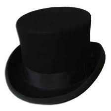

## First Project Retrospective

Gather with your groups and perform a retrospective. We will use a 
simplified version of the [Thinking Hats Retro][thinking-hats], where we
collaborate to discuss the course of the project and our own work on it.

The categories are, in order:

0.  **EMOTIONS**      (White Hat)
1.  **FACTS**         (Black Hat)
2.  **POSITIVE THINGS**   (Green Hat)
3.    **NEGATIVE THINGS**    (Red Hat)
4.   RE/**SOLUTIONS**  (Blue Hat)

Helpful links:

- [Wikipedia definition of a retro][wiki-def]
- [Another definition of "retro"][retro-def]
- [What makes a retro good?][better-retro] [How do you make it better?][better-atlas]
- [The home for Agile retro ideas][retros]

### [The Prime Directive][prime-directive]

> ***Regardless of what we discover, we understand and truly believe 
> that everyone did the best job they could, given what they knew at the
> time, their skills and abilities, the resources available, and the 
> situation at hand.***
>
> —Norm Kerth, *Project Retrospectives: A Handbook for Team Review*

This is the most important (and maybe the only) rule for retros. The
purpose of the retro is to *do better next time*, which assumes that
everyone individually, and the team as a whole, *could have done better*.
This, therefore, is not a place for blame, judgement, or criticism of 
oneself or one's teammates: it's a place to **identify what went well** 
and **what could have gone better**, and then to discuss how to perform 
ensure that the successes are repeated, and the failures are not.

### Process

Working with your stand-up groups from the week, perform the Simplified
Thinking Hats Retro. Each team will need:

- 1 *writer* with the markers: Black, Green, Red and Blue, and a towel…
- 1 *recorder* with a phone and laptop.

Other than these two, *no one on the team should have anything out or 
open.* The retro facilitator (instructor) will run this process, either 
having the groups share back what they've discovered, or retro as a 
class for one or more of the "hats."

After this, follow the steps for each section of the retro:

0.   
    **White Hat**: go around the group and have each person give at least
    one, and no more than two, emotive statements. They should be framed 
    as answers to the question: 
 
    > What feelings do you have about, or did you have during, the sprint?
 
    Take up to 2 minute per team member (up to ten minutes total) to
    discuss these. Feel free to ask each other why, or when, you felt 
    these emotions. **Use this time to calibrate your own responses**, 
    and to be aware of one another's outlook during the course of the 
    retro.
 
    If any emotions are shared, write them down. If they are positive, 
    use Green, if negative use Red, and if neutral use Black.
1.  
    **Black Hat**: the group should now work together to collect as many
    ***facts*** about the sprint as possible. This is usually the
    hardest part of the retro, since you have to answer: 

    > What happenned during the sprint?

    … without reference to emotions, qualitative or valuative statements,
    judgements, comparisons, or even '*why*'s.

    The purpose of this part is to simply jog everyone's memory about
    the sprint, and to focus the retro. It should take no longer than 8
    minutes (maximum!).

    Here are some examples of bad or unacceptable facts, and better ways
    to state them:

    > Bad: *we struggled with using jQuery*   
    > Good: *we used jquery to interact with the DOM*   
    > 
    > Bad: *we did not meet our goal of 15 tickets closed*   
    > Good: (1) *we closed 12 tickets*, 
    >       (2) *our goal was to close 12 tickets*   
    > 
    > Bad: *Phil didn't pull his weight* (especially bad, since it 
    >      breaks the Prime Directive!)   
    > Good: (1) *the team averaged 3 tickets per member*,
    >       (2) (Phil should offer:) *I did not close any tickets…*   

    All of the facts are written in Black (along with the neutral
    emotions). They are not erased for the rest of the retro! From here 
    on, every part needs to reference some *fact* that was listed in 
    this section of the retro.
2.  
    **Green Hat**: the group should now work together to go back over
    the facts, and offer up positive outcomes or events from the sprint.
    These should be phrased as answers to the question:

    > What went well, or what did you do that was successful, during the
    > sprint.

    These "positive things" should help set the tone for the retro, and
    remind everyone to critically identify "wins." Positive things 
    should be written in Green, and *must reference a fact or neutral 
    feeling*. This section should take no more than 5 minutes.
3.  
    **Red Hat**: the group should now work together to go back over
    the facts, and find things about the sprint that were "negative."
    These should be phrased as answers to the questions:

    > What went wrong during the sprint?   
    > What could have gone better?   
    > What "pain points" or "bottlenecks" were encountered?   
    
    … and finally:

    > What obstacles, or "blockers," kept the team or its members from
    > reaching their goals?

    Remember always: **[the Prime Directive](#the-prime-directive)**! 
    At the same time however, don't let the urge to "be constructive" 
    lead you to begin proposing solutions or dismissing criticisms that 
    are raised. Just record them! Save the judgements for the next 
    section!

    Negative things should be written in Red, and *must reference a fact
    or neutral feeling*. This section should take no more than 5 
    minutes.
4.  
    **Blue Hat**: this section of the retro takes place in two parts,

    - first, identifying positive and negative priorities, and…
    - next, proposing resolutions and solutions.

    Once the recorder has photographed all of the points from the retro
    so far (Black, Red and Green), pick a subset of positives and
    negatives to work with: usually at least **one positive** and
    **two negatives**, but no more than three of either. These are the
    priorities for the team, or the most important of the points to
    come out of the retro. *Erase all of the facts, and the positive
    and negative points that are not priorities.*

    Work first with the positive points: write ***resolutions*** for
    each, identifying what the team can do to continue to hit these
    points and institute them in their sprints. For example:

    > In order to ensure the continued support we've found on Slack
    > between team members, we resolve to create a new channel
    > `#support` specifically for asking questions of the team.

    Finally, go through the negative points, and offer concrete
    suggestions, rules or new processes to avoid having these problems
    in the future. For example:

    > The team had major problems this sprint in implementing design
    > tickets. A possible solution may be to have all design tickets
    > go through a single team member in the next cycle, who can
    > pair directly with the designer to implement their tickets.

**And that's that!** Congratulations on finishing your first retro!

Once the team has their set of resolutions/solutions, the recorder should
keep track of them by sending them (as Markdown, not images) to the
facilitator (instructor).

<!--
### Class Resolutions and Solutions

We resolve to:

...

We plan to fix the following problems:

...
-->

<!-- LINKS -->

[wiki-def]:        https://en.wikipedia.org/wiki/Scrum_(software_development)#Sprint_review_and_sprint_retrospective
[retro-def]:       http://www.retrospectives.com/pages/whatIsARetrospective.html
[better-retro]:    http://www.scrumsense.com/blog/retrospectives-makes-retro-good
[better-atlas]:    http://blogs.atlassian.com/2014/12/retrospectives-atlassian/
[retros]:          http://retrospectivewiki.org/index.php?title=Retrospective_Plans
[thinking-hats]:   https://www.google.com/search?q=de%20bono%27s%20six%20thinking%20hats&rct=j
[prime-directive]: http://www.retrospectives.com/pages/retroPrimeDirective.html
