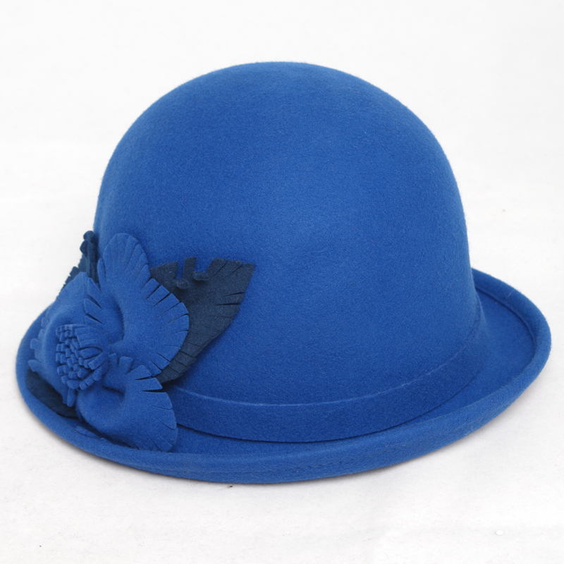

## First Project Retrospective

Gather with your groups and perform a retrospective. We will use a 
simplified version of the [Thinking Hats Retro][thinking-hats], where we
collaborate to discuss the course of the project and our own work on it.

The categories are, in order:

0.  **EMOTIONS**      (White Hat)
1.  **FACTS**         (Black Hat)
2.  **GOOD THINGS**   (Green Hat)
3.    **BAD THINGS**    (Red Hat)
4.   RE/**SOLUTIONS**  (Blue Hat)

Helpful links:

- [Wikipedia definition of a retro][wiki-def]
- [Another definition of "retro"][retro-def]
- [What makes a retro good?][better-retro] [How do you make it better?][better-atlas]
- [The home for Agile retro ideas][retros]

### [The Prime Directive][prime-directive]

> ***Regardless of what we discover, we understand and truly believe 
> that everyone did the best job they could, given what they knew at the
> time, their skills and abilities, the resources available, and the 
> situation at hand.***
>
> —Norm Kerth, *Project Retrospectives: A Handbook for Team Review*

This is the most important (and maybe the only) rule for retros. The
purpose of the retro is to *do better next time*, which assumes that
everyone individually, and the team as a whole, *could have done better*.
This, therefore, is not a place for blame, judgement, or criticism of 
oneself or one's teammates: it's a place to **identify what went well** 
and **what could have gone better**, and then to discuss how to perform 
ensure that the successes are repeated, and the failures are not.

### Process

Working with your stand-up groups from the week, perform the Simplified
Thinking Hats Retro. Each team will need:

- 1 *writer* with the markers: Black, Green, Red and Blue, and a towel…
- 1 *recorder* with a phone and laptop.

Other than these two, *no one on the team should have anything out or 
open.* The retro facilitator (instructor) will run this process, either 
having the groups share back what they've discovered, or retro as a 
class for one or more of the "hats."

After this, follow the steps:

1.  **White Hat**: go around the group and have each person give at least
    one, and no more than two, emotive statements. They should be framed 
    as answers to the question: 
 
    > What feelings do you have about, or did you have during, the sprint?
 
    Take up to 2 minute per team member (up to ten minutes total) to
    discuss these. Feel free to ask each other why, or when, you felt 
    these emotions. **Use this time to calibrate your own responses**, 
    and to be aware of one another's outlook during the course of the 
    retro.
 
    If any emotions are shared, write them down. If they are positive, 
    use Green, if negative use Red, and if neutral use Black.
2.  **Black Hat**: now each group should 

> What happenned during the sprint?

no emotions, no qualitative, no judgements, no comparisons, no "whys"

Ex bad: we struggled with using jquery
Ex good: we used jquery to interact with the DOM

Ex bad: we did not meet our goal of 15 tickets closed
Ex good: we closed 12 tickets, our goal was to close 12 tickets

Ex bad: phil didn't pull his weight* (esp. bad!)
Ex good: the team averaged 3 tickets per member, (phil:) "i did not close any tickets"

<!-- ### Class Resolutions and Solutions

We resolve to:

...

We plan to fix the following problems:

... -->

<!-- LINKS -->

[wiki-def]:        https://en.wikipedia.org/wiki/Scrum_(software_development)#Sprint_review_and_sprint_retrospective
[retro-def]:       http://www.retrospectives.com/pages/whatIsARetrospective.html
[better-retro]:    http://www.scrumsense.com/blog/retrospectives-makes-retro-good
[better-atlas]:    http://blogs.atlassian.com/2014/12/retrospectives-atlassian/
[retros]:          http://retrospectivewiki.org/index.php?title=Retrospective_Plans
[thinking-hats]:   https://www.google.com/search?q=de%20bono%27s%20six%20thinking%20hats&rct=j
[prime-directive]: http://www.retrospectives.com/pages/retroPrimeDirective.html
