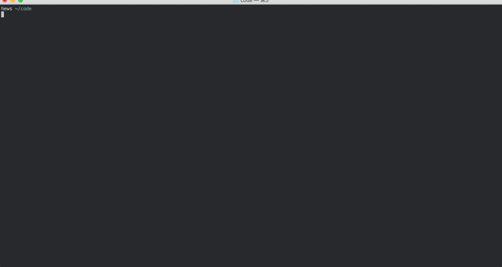

#  Mongoose

> ***For more context, explanations, and examples, see
> [the lesson from class.][lesson]***

### Contents

1.  [**MongoDB**](#mongodb)
    - [Starting and Stopping MongoDB](#starting-and-stopping-mongodb)
    - [Using the Mongo Shell](#using-the-mongo-shell)
    - [Mongo Shell Commands](#mongo-shell-commands)
2.  [**Using Mongoose**](#using-mongoose)
3.  [**Mongoose Vocabulary**](#vocabulary)
4.  [**Mongoose Core API**](#core-api)
5.  [**Links**](#links)

### MongoDB

#### Starting and Stopping MongoDB

To start MongoDB, run the command:

```bash
$ mongod # starts the MongoDB DBMS (server)
```

If this doesn't work, [you need to install it!][mdb-install]

You can **stop MongoDB** by finding the terminal with the server running
and sending `stop` to the process **by typing `Ctrl-C`**:



***If you can't find the terminal with the running process,*** run one
of the commands:

```bash
$ rogue
#=> ...
#=>
#=> COMMAND   PID USER   FD   ...
#=> mongod  26284 hews    5u  ...
#=>
#=> > Use the 'kill' command with the 'PID' of any process you want to quit.

$ ps auxwww | grep mongod
#=> hews           26284   2.0  3.6  5189532 [...]  0:01.24 mongod
#=> hews           26316   0.9  0.0  2434840 [...]  0:00.00 grep mongod
```

In either case, find the "PID" (above, `26284`) and run it with the
command `kill`:

```bash
$ kill 26284
```

#### Using the Mongo Shell

Once MongoDB is running, you can open the MongoDB Shell (in another
terminal) in order to interact with it:

```bash
$ mongo # opens the MongoDB shell, or interactive REPL
#=> MongoDB shell version: 3.2.1
#=> connecting to: test
#=> Mongo-Hacker 0.0.8
#=> Server has startup warnings:
#=> 2016-03-02T11:53:22.356-0800 I CONTROL  [initandlisten]
#=> 2016-03-02T11:53:22.357-0800 I CONTROL  [initandlisten] ** WARNING: soft rlimits too low. Number of files is 256, should be at least 1000
#=> Computer-name(mongod-3.2.1) test>
```

Now we have a prompt! Type `help` to get basic help:

```
Computer-name(mongod-3.2.1) test> help
        db.help()                    help on db methods
        db.mycoll.help()             help on collection methods
        sh.help()                    sharding helpers
        rs.help()                    replica set helpers
        help admin                   administrative help
        help connect                 connecting to a db help
        ...
```

#### Mongo Shell Commands

##### Databases

1.  **See all databases**:

    ```
    prompt> show dbs
    ```
2.  **Connect to a database**:

    ```
    prompt> use <dbName> # eg, use mongo-example-app
    ```

    You'll know that you are connected to the database by the prompt:

    ```
    Computer-name(mongod-3.2.1) test> use mongo-example-app
    switched to db mongo-example-app
    Computer-name(mongod-3.2.1) mongo-example-app>
    ```

##### Collections

1.  **See all collections in a database**:

    ```
    prompt> show collections
    ```

##### Documents

1.  **See all documents in a collection**:

    ```
    prompt> db.<collectionName>.find()
    ```
2.  **See only some documents in a collection**:

    Pass the find method a list of the paths or attributes of the
    document, and a value to match them on:

    ```
    prompt> db.<collectionName>.find( {path: "value"} )
    ```

    For example, if you want to find students named "Phil":

    ```
    prompt> db.students.find( {name "Phil"} )
    ```
3.  **Delete or empty and entire collection**:

    ```
    prompt> db.<collectionName>.remove()
    ```
4.  **Remove some documents in a collection**:

    Like with find above, you can remove specific documents by passing
    paths for it to match:

    ```
    prompt> db.<collectionName>.remove( {path: "value"} )
    ```

    For example (removing by an ID):

    ```
    prompt> db.students.remove({"_id": ObjectId("56d74a0c1d2be212d8af997c")})
    ```

### Using Mongoose

```javascript
var mongoose = require('mongoose');

mongoose.connect('mongodb://localhost/blog_app');

var userSchema = new mongoose.Schema({
    email:  String
});

var commentSchema = new mongoose.Schema({
    author: mongoose.Schema.ObjectId,
    text:   String,
    date:   Date
});

var postSchema = new mongoose.Schema({
    author:   mongoose.Schema.ObjectId,
    title:    String,
    body:     String,
    date:     Date,
    comments: [commentSchema]
});

var User = mongoose.model("User", userSchema),
    Post = mongoose.model("Post", postSchema);

create two users
create a post
add a comment

get all users
```

### Vocabulary

- **connection**:
- schema
  - path
- models
- documents
- statics
- methods
- queries
- embedding
- referencing
- callbacks and promises

### Core API

The API documentation is here.

- Connection
- Schema
  - types
  - validations
  - statics (class methods) & methods (instance/document methods)
  - setters/getters
  <!-- - paths and virtuals -->
- Model
  - documents (ie, instances): #save, #remove, #populate, #execPopulate, etc.
  - queries: .count, .find, .findById, .findByIdAndUpdate, .exec, etc.

### Links

When the cheatsheet is not enough, however (or if you'd like to read
further about the library), here are some links. Keep in mind, that
while the documentation may be fragmented and frustrating, there is a
lot of good information here!

- [The GitHub site has the code and a nice, clear quick start guide.][mg-github]
- [The docs also have a quick start.][mg-quick]
- [The docs follow that with a more comprehensive guide.][mg-guide]
- [Finally, there is a complete API reference in the docs.][mg-api]

<!-- LINKS -->

[mdb-install]: https://docs.mongodb.org/v3.0/tutorial/install-mongodb-on-os-x/


[mg-github]: https://github.com/Automattic/mongoose
[mg-quick]:  http://mongoosejs.com/docs/index.html
[mg-guide]:  http://mongoosejs.com/docs/guide.html
[mg-api]:    http://mongoosejs.com/docs/api.html
[lesson]:    https://github.com/ga-students/WDI_DTLA_8/tree/mongoose/work/w07/d03/instructor/mongoose
