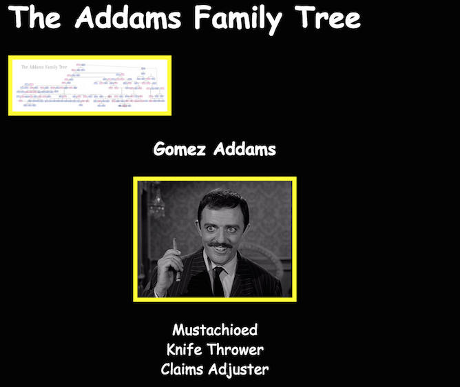
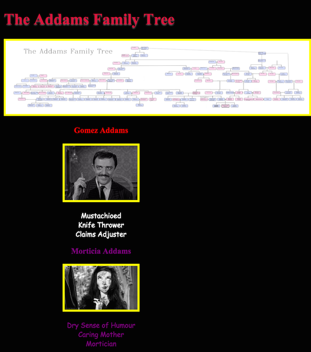

# The Addams Family Tree


### A CSS Selector Lab

In this lab, we are going to explore using CSS selectors to target fun,
weird, and downright *freaky* HTML elements and give them some spooky styles!

For the rest of this lab, use the [given HTML](addams_family_tree.html)
and follow the directions below!

You can add all of your CSS to the `<style>` tag in the HTML header.

## Part 1

Write the necessary CSS to give these default styles to your elements.

```
Images:
  - no bigger than 150px by 150px
  - a yellow border that is 4px wide

Body (ie, the whole page):
  - white text color
  - black background color
  - font size of 14px
  - a font of "Comic Sans," with a fallback of "sans-serif"

Lists (unordered):
  - items are NOT indented
  - there are no bullet points

Sections:
  - center the text within the section
  - 400px wide
  - center the section within the body
```

**When you are done, the page should look like (click to expand):**

[](img/example-part1.png)

## Part 2

Add the below CSS to your `<style>` tag. Then add `class` or `id` attributes
to the HTML page in order to implement these styles. **Do not change the**
**styles, or add or remove HTML!** Only add `class` or `id` attributes to the
HTML to make it work!

```css
/* Apply to the main family tree image. */
.tree img {
  max-width: 1400px;
  width: 100%;

}

/* Apply to the main header. */
.tree .title {
  color: crimson;
  text-shadow: 0px 2px 2px rgba(255, 255, 255, 0.4);
  font-size: 32px;
}

/* Apply to all of the family members' names by default. */
.name {
  font-weight: bold;
  color: red;
}

/* Apply to all of the family members' names and the page title. */
h1.title,
h2.title,
h3.title,
h4.title {
  font-family: Times New Roman, serif;
}

/* Apply to all of Morticia's elements. */
#morticia,
#morticia h3 {
  color: purple;
}

/* Apply to Lurch's name. */
#lurch .name {
  font-size: 24px;
  color: green;
}

/* Apply by default to the list items within Wednesday Addams. */
#wednesday li {
  text-decoration: line-through;
  color: gray;
}

/* Apply to the list item within Wednesday Addams that is "Somber". */
#wednesday li.somber {
  text-decoration: underline;
}
```

**When you are done, the page should look like (click to expand):**

[](img/example-part2.png)


## Part 3

Implement the following rules by adding new classes to elements and creating
their CSS.

```
- All sections have white borders with rounded edges.
- When you hover over an image, the border turns red.
```

## Part 4

<div></img>
</img>
</div>

Create info for [Cousin Itt](http://addamsfamily.wikia.com/wiki/Itt) and [The Thing](http://addamsfamily.wikia.com/wiki/Thing).

<!--
- Use selectors (id/class) 
- Make use of your knowledge of specificity (id / class / heirarchy)
- Be sure to include styling for
  - color 
  - background (if not done already)
  - font size
  - font family
  - font weight
  - text decoration
  - text-align 
  - width
  - height
- Make use of a `:hover` psuedo-class
-->

## Bonus, for you Special Creatures

Web Typography is a huge part of web development. Horrific fonts can __seriously__ kill a website. For the bonus:

- Read more about [web typography](./web_typography.md)
- Exchange `px` for `em` or `rem` in your Addams Family Tree
- Import some [google fonts](https://www.google.com/fonts) into your Addams Family Tree and use a different font for the family members' names (the h3 tags).
