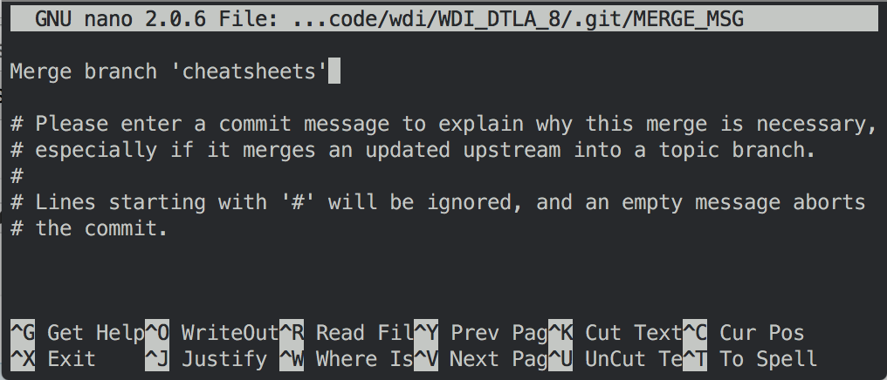

# Beginner Git & GitHub Workflow

We are going to start practicing **Git** every day by using it to store 
and share our classwork. We do this in our ***class repo***! The class
repo should live in the folder `~/code/wdi`.

In general, you use Git in two different ways:

1.  Version control: Git helps you save backups of your codebase, or repo.
    Each save is called a *snapshot*, or ***commit***. All of your commits
    are your *history*, or ***commit log***.
2.  Colaboration: Git helps you share your work with others, and to
    ***merge*** changes that you and others have made to the same repo.
    Other versions of a repo that you can connect to are known as 
    ***remotes***, while your current copy of the repo is known as 
    ***local***.

## Basic Git Workflow


**Our beginning workflow for the class looks like this:**

```
$ git pull upstream master

(… edit, create and delete some files)

$ git add -A
$ git commit -m "some commit message"
$ git push origin master
```

For more information, see below:

### Git as Version Control

When saving the state of your repo, these are the most important commands
to remember:

- `git status`: at any time, you can check the "status" of your repo; ie
   what files or directories have been created, deleted, or edited.
- `git add -A`: to save any of the changes in your status, you need to
   add, or ***stage*** them first. Anything that's staged will be saved
   when you commit, anything not staged won't be saved.
- `git commit -m "commit message"`: save the changes you've staged!
- `git log` (or `git ll`): see your history of commits. `git log` tells
   you all of the information, while `git ll` gives you a very concise
   list of messages and their ***commit ids***.

### Git Commit Messages

Every commit *must* have a message! We'll learn more about how to write
good commit messages in the future, but for now please remember:

1.  write in present tense, ideally in the imperative:
    ```
    add a new file
    close an issue
    solve the lab
    ```

2.  and keep it short, ideally under 50 characters!

Often, if you forget to write a commit message, or Git automatically
merges changes and makes a new commit for you, you will be dropped in
to [`nano`][nano], a command-line text-editor.

If you forgot to write a message, type it in there. If there's already
a message (usually begins "Merge branch ..."), then you're good!



Just accept the message by typing `^X` (`Ctrl-X`), and if necessary `Y`
then `↵` (`Return`).

### GitHub as a "Git Remote" Host

**GitHub** is an online service that stores Git repos. You will usually
share and connect to other repos via the GitHub service.

- `git remote -v`: print out the list of your current remotes.
- `git remote add <short_name> <GitHub_link>`: adds a new remote.
- `git clone <GitHub_link>`: downloads a repo and sets it as a the remote
  `origin`.

You should have two remotes, which go by the standard names `origin` and
`upstream`: 
  - `origin` is a remote you control, and
  - `upstream` is a remote you can access but don't control.

When you connect to a remote, you can link to it via `ssh` or `https`.
Both links are secure, but SSH "stores" your password on your computer
so you don't need to enter it every time you access the remote from that
computer.

### Git as a Tool for Collaboration

When connecting to your repo's remote versions on GitHub, these are the 
most important commands to remember:

- `git pull upstream master`: get changes from the `upstream`, or
  *instructor* (`ga-students`) repo.
- `git push origin master`: send changes to the `origin`, or your online
  backup of your repo on GitHub.

<!-- LINKS -->

[nano]: https://en.wikipedia.org/wiki/GNU_nano
