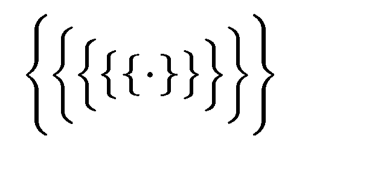
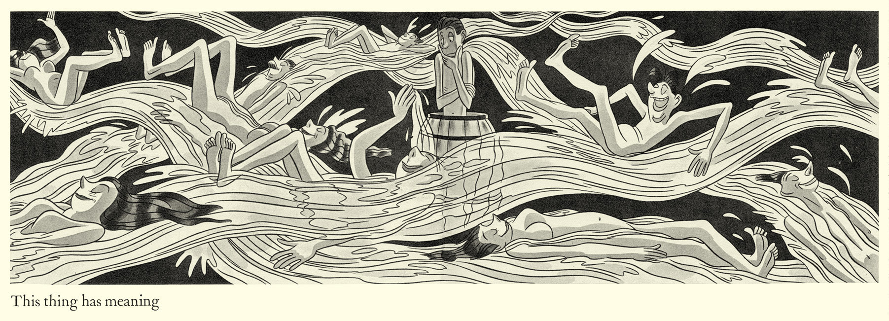
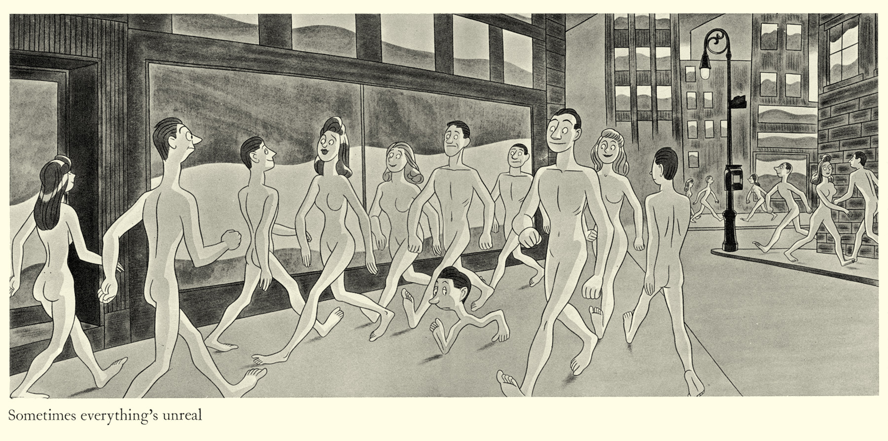

# The Tragedy of Obediah Jecht



## Objects in JavaScript

| Learning Objectives                      |
| ---------------------------------------- |
| Create JavaScript Objects using Object Literals |
| Use JS Objects to Model Real World Objects |
| Create nested (JS) Objects by referencing other (JS) Objects and Arrays. |
| Delete properties from (JS) Objects at run-time. |
| Define what "key-value" pairs and "properties" mean in reference to (JS) Objects. |
| Identify the properties and values in a given (JS) Object. |
| Reference or update a value in a (JS) Object by its property. |

## Roadmap

1. Intro to Object Oriented Programming
2. Creating Objects - the Birth of Obediah Jecht
3. Designing Objects - the Life of Obediah Jecht
4. Removing Properties from Objects - Obediah Jecht's Tragic Epiphany
5. Outro

## Intro to Object Oriented Programming (OOP)

As web developers, we practice Object Oriented Programming techniques. With OOP, our programs are crafted from objects, which have data and behavior, and are used to model real world objects.  During the program's execution, these objects interact with each other to accomplish the programming goal.

**When have you seen real world objects modeled in a website?**

## Creating Objects - The Birth of Obediah Jecht


> Obediah, son of Obayashi and Obedience Jecht, came into this world as any other, just the shell of who he would become:

`{}`

>  Moments after his birth, the Jechts wanted to give their son a name, one that made their family proud. Of course, he was given the family name:

`lastName: "Jecht"`

> …but he was also given a strong first name.

 `firstName: "Obediah"`

> However, Obediah is a long name and at the time, a common one too. He needed a unique nickname, one so odd that he'd have no problem being seen as an individual:

``` javascript
var obJecht = {
  firstName: "Obediah",
  lastName: "Jecht",
  age: 0,
  hair: null
}
```

#### Object Literal Syntax …and the World Met Obediah

Let's look at Obediah and how he shows a model of a brand new bouncing baby boy.

Our Obediah was born using an __object literal__. When we need a singular item, this is a great way of providing it. Simply name the variable, and assign it to an empty object, like so:

`var emptyObject = {};`

Alternatively, you can fill that object when defining it:

``` javascript
var filledObject = {
	firstKey: true,
	secondKey: "this is a value"
};
```

Take a look at the `filledObject`. As you can see, Javascript objects contain a collection of zero or more undordered _properties_.

__Properties__ have two features:

- a __key__ (alternatively known as a _name_)
- a __value__

Together, these are known as __key:value__ pairs. Within a JS object, the _key_ and _value_ are separated by a colon, and the _properties_ are separated by commas. A _value_ can be any type of data.

**What kinds of types of data do we know about?**

In the case of Obediah, we have two two `String` values for our `firstName` and`lastName` keys, and a `Number` value for our `age` key.

When properties contain data (eg. `lastName`, `firstName`, and `age`) they're referred to as __attributes__.

A _value_ can also be a function. We'll learn more about this later, but just know that a property is called a __method__ when its value is a function.

Both _methods_ and _attributes_ are _properties_. Additionally, Objects in JS are dynamic, meaning their properties can be changed, added & removed during runtime.

## Designing Objects - the Life of Obediah Jecht



> As time went on, Obediah grew up.

`obJecht.age += 5;`

**This is what we mean by objects are dynamic!**

> And he learned to yell for his momma:

``` javascript
obJecht.callForMomma = function() {
	alert('MOMMY!!');
};
```

Just so you know, `obJecht.callForMomma` is a _custom method_ created by us - again, we'll get to methods in MUCH greater depth later.

> His bald head became a thick mane of brown hair:

`obJecht['hair'] = true;`

`obJecht.hairColor = "brown";`

> And under that hair was an especially great mind.

`obJecht.mind = "beautiful";`

We declared a key and assigned a value to it. Now we have access to the _attribute_ `hairColor: "brown"` as well as the _attribute_ `mind: "beautiful"`. As we see with `obJecht['hair']`, we can access properties of an object with either a period or brackets containing quotes.

All of these are _properties_ on Obediah, the `obJecht` object.

#### The People and Things in Obediah's Life

> For his 5th birthday, Obediah was given an adorable teddy bear,

``` javascript
var teddy = {
	cute: true,
	eyes: "buttons"
}
```

> Obediah loved his teddy bear, and often reminded others that it was HIS teddy bear.

`obJecht.toys = teddy;`

> He was also given a flashy yo-yo that he also took quite a bit of pride in.

- Can anyone tell me how I would build a `yoYo` object with two custom attributes?


- How would we create a friend for Obediah?


- Now that Obediah has two toys, how do you think we should store them in `toys` key?

#### Referencing in Javascript Objects

In Javascript, referencing to another object is as easy as setting a _property_. For instance, `obJecht.toys` is simply a reference to the teddy object. We can even access the teddy properties through `obJecht`.

`obJecht.toys.eyes`

We can also make arrays of other objects or primitive types.

`obJecht.toys = [teddy, yoYo]`

**How could we access the teddy's eyes through Obediah now?**

When accessing variables within an array, you must refer to them by their index.

Since we've put teddy first, his index number is `0`. Remember that in computing, index numbers start from 0.

#### Obediah the Genius - Practice

>  As Obediah aged, he excelled in school, finishing high school three years early. 
> 
> But so ravenous was his hunger for knowledge, he decided to immediately head for Cambridge.

Let's practice what we've learned:

- Add 10 to the Obediah's age property


- Create a _name_ `graduateHS` on the Obediah and set the *value* to `true`.

> There Obediah started to read a lot of existential philosophy and built a set of troubling beliefs.

- Create a __key__ `favAuthors` and assign it to an array of `"Nick Bostrom"`, `"Soren Kierkegaard"`, and `"Albert Camus"`.

## Removing Properties from Objects - Obediah Jecht's Tragic Epiphany



> Obediah became obessessed with the idea of being, as he had a sneaking suspicion about reality. One day he tells me:
> 
> "I believe the world is nothing but a series of objects in a program." He murmured.
> 
> "By the very nature that we understand the idea of how to program a universe, it is therefore more likely that we are, in fact, in one of the infinite simulations of a universe than our actual universe."
> 
> He seemed unhinged and I couldn't follow his logic. I asked him to elaborate...
> 
> "Well look at this house!" bellowed Obediah as he pointed to my home. "It has 2 rooms, 3 bathrooms, and it's painted gray! They're just simple attributes when you think about it!"

**Make that house into an object using object literal notation!**

> "You see!" Obediah exlaimed. "Everything in nature is actually an object!"
> 
> And then Obediah became very serious and detached, sounding more unhinged by the moment.
> 
> "In fact, the very nature of nature... our very understanding of the universe. We sit on a singular planet in an enormous galaxy... It's as if we don't move… we may as well just be data in a server... a server in the middle of a desert the size of the universe...."
> 
> "We're all just inanimate objects."

`obJecht.mindBlown = true;`

> I shook my friend Obediah, but he did not respond. We quickly ran him to the hospital, and the doctor confirmed our worst fears:
> 
> "Obediah's mind was blown and there is no coming back" reported the doctor.
> 
> Her voice shook with despair. "He'll begin to lose his memories soon…"
> 
> And sure enough, Obediah began to forget. First, he forgot the color of his yo-yo.

`obJecht.toys[1].color = null;`

**Here we have not deleted the _property_, but instead set it to `null`.**

Now the null value is attached to the `color` _key_.

>  He forgot his favorite authors first.

`delete obJecht.favAuthors;`

Now, we've actually removed the property entirely. We can no longer access `obJecht.favAuthors`.

**How would we make Obediah forget his toys? What happens to `teddy` and `yoYo`?**

> Eventually, he was no longer himself. He lost his identity.

`obJecht = {};`

We've now assigned him to an empty object. In runtime, this will wipe the object of all custom properties.

## Outro

Now you know the great tragedy of Obediah Jecht. We all hope that in time he comes back to us, but, knowing the JS compiler, it's unlikely.

Let's go over what we learned:

- How do we create an object using an object literal?
- What is another term for an object property
- Object properties can contain what kinds of data types?

#### References

[MDN JS Object](https://developer.mozilla.org/en-US/docs/Web/JavaScript/Reference/Global_Objects/Object)

[MDN Working with Objects](https://developer.mozilla.org/en-US/docs/Web/JavaScript/Guide/Working_with_Objects)

[MDN Intro to Object-Oriented JS](https://developer.mozilla.org/en-US/docs/Web/JavaScript/Introduction_to_Object-Oriented_JavaScript)