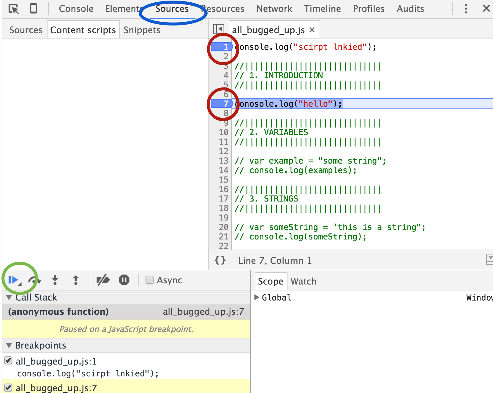

# All Bugged Up

## Debugging in JavaScript

Last night, you may have worked on nodeschool.io's javascripting tutorial.

I figured I could use the practice and did the same thing! However, I never checked my code while writing, and when I ran it, oh boy did I have some errors.

In today's exercise, you're going to fix my code!

#### Assets

Please copy the `starter_code/` outside of `instructor/`. You'll be fixing my `all_bugged_up.js` file - after opening up the `index.html` in the browser, you can ignore the html page and work solely in the console. 

#### Chrome Dev Tools

If you can't figure out why something is messing up, often a great tool is the chrome debugger. 

Please click on the `sources` (blue circle) tab in your chrome developer tools (otherwise known as web inspector).

You can set break points (red circles) and go to the next one using the "resume script execution" button (green circle).

#### References

[Chrome Dev Tools](https://developers.google.com/web/tools/chrome-devtools/?hl=en)