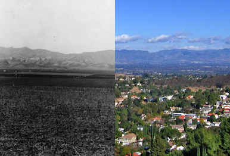

# Seeming Wasteland

### Setup

Open the `index.html` file in a browser. Feel free to edit both the
`main.js` file and `style.css` file to perform all of the actions below.

Write the changes in to their respective files, refreshing the page
after each action.

### Exercises

**Use JavaScript to manipulate the DOM and do the following:**

1.  Create a `
` element, save it to a variable called `house`, and 
    give it a class of `dwelling`.
2.  Append this `
` (in the variable `house`) to the `<body>`.
3.  Create two new elements:
    - an `<h1>` saved to the variable `topLevelHeaderEl`, and
    - a `` saved to the variable `span`.
4.  Check out [this][span-article] article for a second. It explains why
    the `` tag is useful in HTML. Then:
    - give the span the text content of **"Seeming Wasteland"**;
    - give the span the class of `shadowed`.
5.  Append the span (as a child) to the `topLevelHeaderEl`.
6.  Append the `topLevelHeaderEl` (as a child) to the `<body>`.
7.  Create a new `
` element and save it to the variable `waldo`.
8.  Give this `
` (in the variable `waldo`) an `id` of `waldo`.
9.  Append the `
` (in the variable `waldo`) to the `<body>`.
10. Create a `<ul>` element and save it to a *sensibly named variable*.
11. Uncomment the `birds` array. Iterate through the array, and create 
    an `<li>` for each bird. Give each `<li>` the class of `bird` and 
    the text content of the bird's name. Finally, append the `<li>` to
    the `<ul>` you created.
12. Append the `<ul>` (as a child) to the `<body>`.
13. Add 5 more elements (each with a different tag) to the DOM so that 
    this seeming wasteland becomes lush. Feel free to get creative with
    the CSS.
14. Once the wasteland is no longer a wasteland, change the span tag
    (in the variable `span`) to have the text content **"Teeming Funland"**.

<!-- LINKS -->

[span-article]: http://www.sitepoint.com/web-foundations/span-html-element
