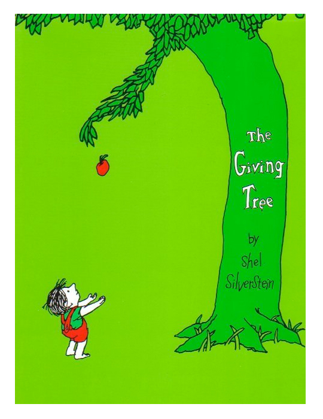
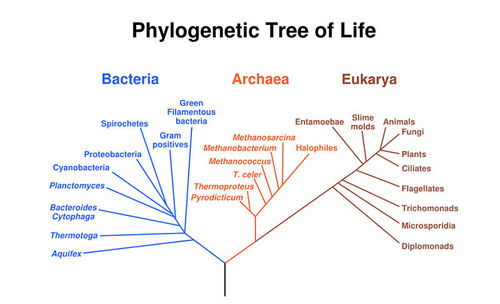
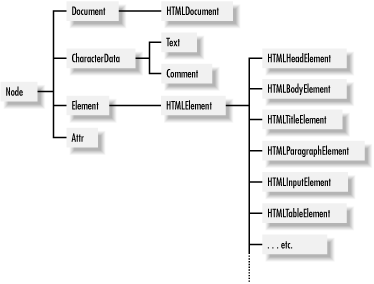
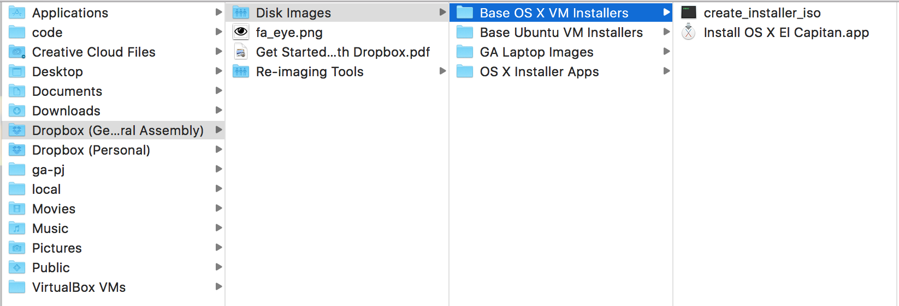
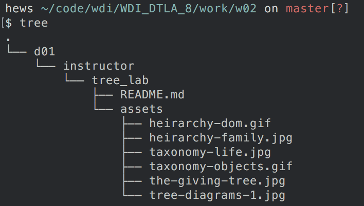
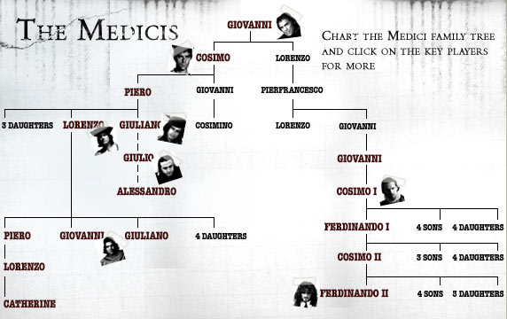
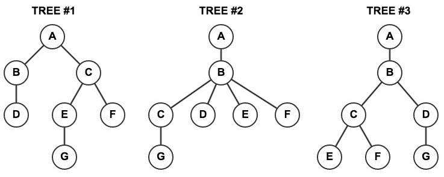

# Tree Lab!



> **The gift that keeps on giving...**

| Objectives |
|:-----------|
| Identify relationships between nodes in a tree: ancestors, parents, siblings, children, and descendants. |
| Identify relationships between DOM nodes (elements): ancestors, parents, siblings, children, and descendants. |
| Draw the DOM tree for a given HTML page. |

Everywhere we look in computers, [we will find *trees*][wiki-tree]. 
Trees are a data structure that follow a few simple rules:

- information is stored in nodes,
- every node has *direct* relationships with other nodes,
- there are two types of *direct* relationships: parent and child,
- every tree has a *root*, or one node without a parent,
- every other node has *one and only one* parent,
- every node may have zero or more children,
- if Node A has a child Node B, Node B's parent is Node A.

Here are examples of trees:

1. Classification systems, often called taxonomies, or type systems:

   
   
2. Storage systems, like your computer's filesystem:





3. Heirarchal systems, like a family tree or an HTML page:




---

### Lab Part 1 – Abstract Tree Structures



> Given the above diagram, answer the following questions **for each tree!**

1.  Which node is the root node?
2.  Which nodes are the leaf nodes?
3.  What are the children of node `B`?
4.  What are the siblings of node `D`?
5.  What are the descendants of node `C`?
6.  What are the ancestors of node `F`?

### Lab Part 2 – Filesystems

> Below are a series of filesystem commands. Construct the tree representation
> of the described filesystem **for each group of commands!** Each group
> is describing a separate tree, they don't have to work together.
> 
> _**Bonus**: do you know what the name of the root node of each tree is?_

#### Filesystem Tree α (alpha)

```
$ pwd
=> /Users/student
$ cd code
$ ls
=> homework/  koans/  personal-site/  wdi/
$ cd personal-site
$ ls -a
=> ./  ../  .gitignore  LICENSE  README.md  css/  index.html  js/
$ cd css
$ ls
=> main.css  normalize.css
```

#### Filesystem Tree β (beta)

```
$ pwd
=> /
$ cd usr/local
$ cd bin
$ ls
=> node  npm  pry   ruby  subl
$ cd ..
$ ls
=> Frameworks/  Library/  README.md  bin/
=> etc/         lib/      opt/       var/
```

#### Filesystem Tree γ (gamma)

```
$ cd Documents
$ cd work
$ git init
$ mkdir -p exercises/javascript
$ touch LICENSE exercises/README.md
$ mkdir exercises/html
$ cd exercises
$ touch javascript/scope.js javascript/functions.js javascript/vars.js
$ cd ..
$ touch README.md
```

### Lab Part 3 – HTML & the DOM

> Below are a series of chunks of HTML, each of which is contained in the
> `<body>` tag. Treating `<body>` as the root, do the following:
> 
> 1.  Draw the DOM tree for the given HTML.
> 2.  Give the `id` **or `id`s** of the element requested in the given 
>     [CSS selectors][relationship-selectors] beneath each set of HTML.
> 
> _**Bonus**: the final section, HTML ג (gimmel), is bonus!_

[relationship-selectors]: https://developer.mozilla.org/en-US/docs/Web/Guide/CSS/Getting_started/Selectors#Information.3A_Selectors_based_on_relationships

#### HTML א (aleph)

```html
<body>
    <header id="one">
        <nav id="two">
            <a id="three">Home</a>
            <a id="four">About</a>
        </nav>
    </header>
    <main id="five">
        <h1 id="six">Welcome!</h1>
        <p id="seven">Lorem ipsum dolor sit amet, consectetur adipisicing elit.
           Fugit facilis dicta necessitatibus earum enim deleniti ullam 
           recusandae tempora, ipsa iure saepe maxime debitis autem, a 
           libero provident aliquid corporis quo.</p>
    </main>
    <footer id="eight">
        <span id="nine">WDI © 2015</span>
    </footer>
</body>
```

**Selectors**

- `nav a`
- `#five p`
- `span`

#### HTML ב (beth)

```html
<body>
    <div class="red stars" id="one">
        
        <p id="three">Lorem ipsum dolor sit amet, consectetur adipisicing elit.
           Error, iure. Molestiae <span id="four">facilis suscipit 
           tempore</span> quibusdam saepe nesciunt.</p>
        <p id="five">Lorem ipsum dolor sit amet, consectetur adipisicing elit. 
           Similique expedita placeat voluptatum quas maiores.</p>
    </div>
    <div class="white" id="six">
        <div class="stars" id="seven">
            
        </div>
        
    </div>
    <div class="blue" id="ten">
        <div class="stars" id="eleven">
            
            <p id="thirteen">Lorem ipsum dolor sit amet, consectetur adipis 
                elit. Id laboriosam, sed, quia sunt asperiores nesciunt quae, 
                numquam temporibus maxime incidunt impedit quam facilis! 
                Maxime nulla vel id, maiores harum suscipit?</p>
        </div>
    </div>
</body>
```
**Selectors**

- `div img`
- `div div img`
- `.blue img`
- `.stars + img`
- `div > p`

#### BONUS: HTML ג (gimmel)

```html
<body>
    <div class="red" id="one">
        <div class="red white stars" id="two">
            <h3 id="three">Lorem ipsum dolor sit amet</h3>
            <p id="four">Lorem ipsum dolor sit amet, <em id="five">consectetur 
              adipis</em> elit. Nemo quasi blanditiis, saepe aspernatur 
              explicabo laudantium quidem eligendi possimus 
              <span class="white" id="six">dolorem 
              <strong id="seven">perferendis impedit</strong> similique 
              suscipit velit excepturi, <em id="eight">illo</em>, id amet quas
              tenetur.</span></p>
            <p id="nine">
                <span id="ten">Lorem ipsum dolor sit amet, consectetur adipis 
                  elit. Repudiandae accusantium architecto aliquid doloribus
                  optio natus consequatur laboriosam harum quaerat laudantium
                  totam perferendis consectetur, corporis eos suscipit.</span>
                <span id="eleven">Aperiam perferendis explicabo tempore est.
                  Rerum, sequi libero necessitatibus non deleniti laboriosam 
                  perspiciatis totam <em class="white" id="twelve">cupidit</em>
                  doloribus pariatur alias consectetur nulla laudantium ipsam
                  praesentium adipisci!</span>
            </p>
            <p id="thirteen">Lorem ipsum dolor sit amet, 
               <em id="fourteen">consectetur adipis</em> elit. Nemo quasi 
               blanditiis, saepe aspernatur explicabo laudantium quidem 
               eligendi possimus <span class="white" id="fifteen">dolorem 
               <strong id="sixteen">perferendis impedit</strong></span>
               similique excepturi, <em id="seventeen">illo</em>, id amet 
               quas tenetur.</p>
        </div>
        <div class="red" id="eighteen">
            <div class="blue stars" id="nineteen">
                <p id="twenty">Lorem ipsum dolor sit amet, 
                  <em id="twentyone">consectetur adipis</em> elit. Nemo quasi 
                  blanditiis, saepe aspernatur explicabo laudantium quidem 
                  eligendi possimus.</p>
            </div>
        </div>
    </div>
</body>
```

**Selectors**

- `p > .white`
- `h3 + p > *`
- `.red .stars em`
- `.red > .stars em`
- `p + p`
- `span.white + *`

<!-- LINKS -->

[wiki-tree]: https://en.wikipedia.org/wiki/Tree_(data_structure)
