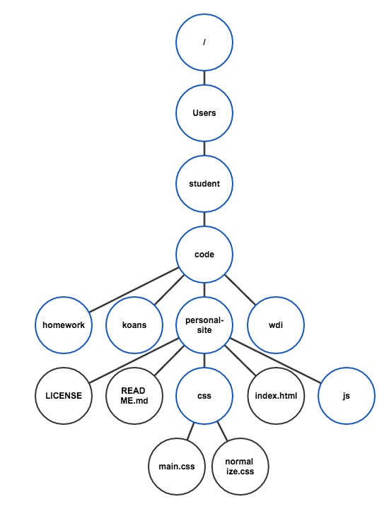
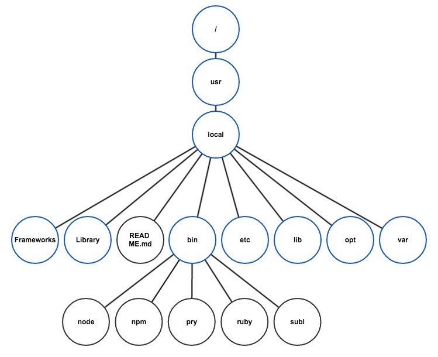
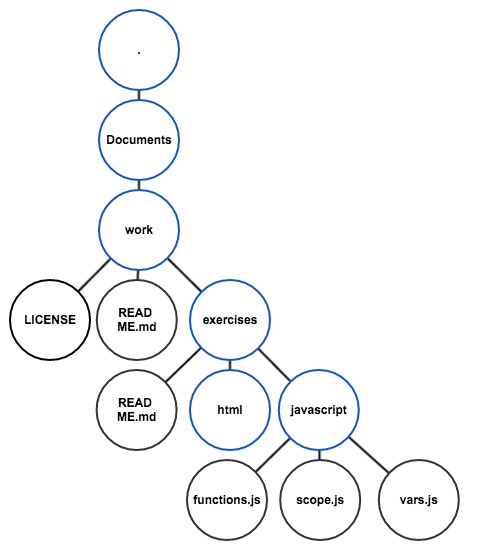
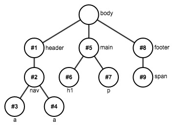
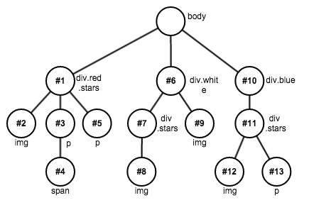

## Part 1 – Abstract Tree Structures

1.  Which node is the root node?
    - Tree #1: `A`
    - Tree #2: `A`
    - Tree #3: `A`
2.  Which nodes are the leaf nodes?
    - Tree #1: `D`, `F`, `G`
    - Tree #2: `D`, `E`, `F`, `G`
    - Tree #3: `E`, `F`, `G`
3.  What are the children of node `B`?
    - Tree #1: `D`
    - Tree #2: `C`, `D`, `E`, `F`
    - Tree #3: `C`, `D`
4.  What are the siblings of node `D`?
    - Tree #1: none
    - Tree #2: `C`, `E`, `F`
    - Tree #3: `C`
5.  What are the descendants of node `C`?
    - Tree #1: `E`, `F`, `G`
    - Tree #2: `G`
    - Tree #3: `E`, `F`
6.  What are the ancestors of node `F`?
    - Tree #1: `A`, `C`
    - Tree #2: `A`, `B`
    - Tree #3: `A`, `B`, `C`
7.  What nodes are in the branch `D`?
    - Tree #1: `D`
    - Tree #2: `D`
    - Tree #3: `D`, `G`
8.  What is the `E` node's path?
    - Tree #1: `A/C/E`
    - Tree #2: `A/B/E`
    - Tree #3: `A/B/C/E`

## Part 2 – Filesystems

### Filesystem Tree α (alpha)

```
/
└── Users
    └── student
        └── code
            ├── homework
            ├── koans
            ├── personal-site
            │   ├── LICENSE
            │   ├── README.md
            │   ├── css
            │   │   ├── main.css
            │   │   └── normalize.css
            │   ├── index.html
            │   └── js
            └── wdi
```



### Filesystem Tree β (beta)

```
/
└── usr
    └── local
        ├── Frameworks
        ├── Library
        ├── README.md
        ├── bin
        │   ├── node
        │   ├── npm
        │   ├── pry
        │   ├── ruby
        │   └── subl
        ├── etc
        ├── lib
        ├── opt
        └── var
```



### Filesystem Tree γ (gamma)

```
.
└── Documents
    └── work
        ├── LICENSE
        ├── README.md
        └── exercises
            ├── README.md
            ├── html
            └── javascript
                ├── functions.js
                ├── scope.js
                └── vars.js
```



## Part 3 – HTML & the DOM

### HTML 1

```
<body>
└── <div>
    ├── <h1>
    ├── <p>
    └── <p>
        └── <a>
```

### HTML 2

```
<body>
├── 
├── <div.search-box>
│   ├── <input>
│   └── <f> (an icon tag)
├── <ul.screenshots>
│   ├── <li> ── 
│   ├── <li> ── 
│   ├── <li> ── 
│   ├── <li> ── 
│   ├── <li> ── 
│   ├── <li> ── 
│   ├── <li> ── 
│   └── <li> ── 
└── <p>
    └── <a>
```

### HTML 3

```
<body>
├── <nav>
│   ├── <a.instagram-brand>
│   └── <div.float-right>
│       ├── <input>
│       └── <a.current-user-name>
└── <main>
    └── <article>
        ├── <header>
        │   ├── <a.user-profile-pic>
        │   ├── <a.user-name>
        │   └── <span.time>
        ├── <div.image-container>
        │   └── 
        └── <div>
            ├── <p.likes>
            ├── <p.caption>
            │   └── <a.user-name>
            ├── <hr>
            └── <div>
                ├── <a.like-pic-heart>
                ├── <form>
                │   └── <input.comment>
                └── <a.more-menu>
```

### HTML א (aleph)



- `nav a`:   #3, #4
- `#five p`: #7
- `span`:    #9

### HTML ב (beth)



- `div img`:      #2, #8, #9, #12
- `div div img`:  #8, #12
- `.blue img`:    #12
- `.stars + img`: #9
- `div > p`:      #3, #5, #13

### HTML ג (gimmel)

(unanswered… check with other students!)
