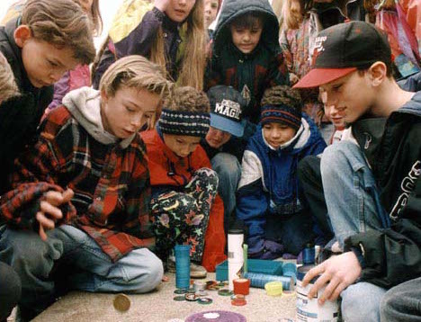

# Pogs: the Ultimate Throwdown

### *When you play POGS.ly, you play for keeps.*

---

This lab involves creating a web app called **POGS.ly**, which is an
online version of the [90s gaming craze "pogs."][pogs-wiki] Pogs has a 
very simple ruleset, and so should be easy to learn.

Your objective is to **wireframe** the game and create a set of 
**User Stories** that describe features to implement. You then have to 
classify the features and plan for a **sprint** to create an **MVP** 
(minimum-viable product). Finally, you should **model** the game you've 
created in JavaScript, either as a data collection or a "class" 
(constructor function).

You've been provided with sample assets (images) to fuel your creative
juices!

[pogs-wiki]: https://en.wikipedia.org/wiki/Pogs

---

## Rules

[From Wikipedia:][pogs-wiki]

> Rules vary among players, but the game variants generally have common 
> gameplay features. Each player has his/her own collection of pogs and 
> one or more slammers. Before the game, players decide whether to play 
> "for keeps", or not. "For keeps" implies that the players keep the 
> POGs that they win during the game and forfeit those that have been 
> won by other players.

Our simplified version of the ruleset will be this:

1.  There are two players, and the screen will alternate between them.
2.  The two players and their pogs are hard-coded into the site:
    - Player 1 (Ezra) has 8 "Lisa Frank"-themed pogs.
    - Player 2 (Dean) has 8 "Heroes of the US Supreme Court"-themed pogs.
3.  The player will click on the *slammer* to crash it in to the *stack*.
4.  After being slammed, a random number of the pogs appears face-up.
    The current player adds the face-up pogs to their *collection*,
    removing them from the *stack*.
5.  When the stack reaches zero, the game is over, and one player is
    declared *winner*.
6.  When you play POGS.ly, you play *for keeps*.

Feel free to [research pogs further][yt] or come up with your own 
"flavor" of the game!

[yt]: https://www.youtube.com/watch?v=l3MwDOiXo38

## Part 0 – Create a Repo

Create a new repo locally, and on GitHub, called `pogsly_lab`. Ensure
the repo has a file `README.md` and a folder named `assets`.

From here on out, add any information you have to your `README.md`
and push it up. Any images should be added to `assets` and linked in to
your `README.md`.

## Part 1 – Wireframes

Create wireframes for your game. While you can use special applications
to build your wireframes, please start by using "pen & paper" (or
"marker & desk"). Take pictures and add them to your repo's `assets`
folder. These are often called **Low-fidelity** wireframes.

Links:

- [Beginner's Guide][guide]
- [Balsamiq][balsamiq] (Medium-fidelity wireframes)
- [Sketch][sketch] (High-fidelity wireframes)

[guide]:    http://webdesign.tutsplus.com/articles/a-beginners-guide-to-wireframing--webdesign-7399
[balsamiq]: https://balsamiq.com
[sketch]:   http://www.sketchapp.com

### Deliverable

A series of wireframes describing what will be visible to the user
who uses your site. These discrete wireframes should be connected
by "flows" (or arrows) describing how a user can arrive at the
wireframed state/page from any other. DO NOT SKIP THIS!

### Bonus (for the Design-inclined)

Create a separate set of wireframes for the two other major form-factors
for modern computing: tablets (in portrait and/or landscape) and mobile 
devices.

The general rules for the differences are this:

[**Layouts**][balsamiq-layouts]

- **Default** (desktop/laptop)
    - Orientation: landscape
    - Min-width: 780px
- **Tablet**
    - Orientation: portrait/landscape
    - Min-width: 768px
    - Max-width: 979px
- **Mobile**
    - Max-width: 480px

[balsamiq-layouts]: http://support.balsamiq.com/customer/portal/articles/615901

## Part 2 – User Stories

## Part 3 – Identify an MVP (ie, Sprint Planning)

## Part 4 – Model the App

## Bonus – Create the Game!

