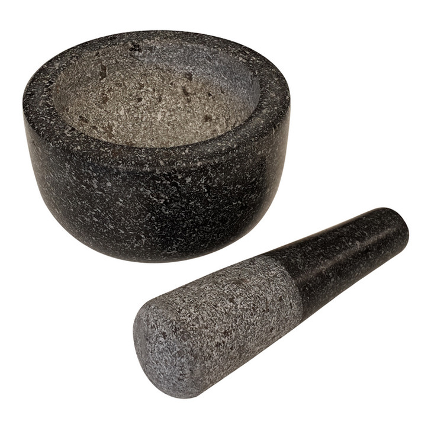

# Whack–a–molé

**A comprehesive JavaScript application-building lab.**

### Part 1 – Initial Planning

Using the below description, write a series of User Stories that
describe the features you would have to implement to make this 
application a reality:

> ***Whack–a–molé*** is a fun, quick version of [Whack–a–mole][whack_a_mole]
> for the family! When you play, there is a grid of 9 cells. An avocado
> appears randomly in some of these cells (one avocado at a time).
> When you click on the avocado it gets "mashed" into guacamolé! Once
> you've mashed the grid full of guacamolé you win the game!

**Write User Stories before moving on.**

### Part 2 – User Stories from Wireframes (Mock-ups)

Now, using the below images, update your User Stories to fit the new
information you can find by more actively "envisioning" the application
and how a user interacts with it.

**[Click here to see wireframes.][wireframes]**

Put the User Stories into an Agile (Kanban) workflow:

- Ice Box
- MVP (Current/Sprint)
- Complete (Delivered/Accepted)

Order the sotries from most-to-least important (top-to-bottom).

### Part 3 – User Story Overview

Finally (for planning), check this actual, 
[working version of the game][game_link].

Identify:

- How did the app you envision stack up to the reality? Better? Worse?
- What more would you add to your list of features (User Stories)?
- How would you re-order your features?
- Is there anything essential that is missing from the game? Do you
  think it is an MVP?

---

### Part 4 – Initialize Application

> Time to Rock n' Roll!

Alright, now that we've planned, let's set up the `git`/GitHub part of 
our project!

- Create a brand new **repo** for your game, with the name 
  `whack_a_mole`, *outside of our class repo*. Make sure that it is
  linked to a remote on GitHub.
- Create a `README` and do the initial setup for the online repo.
- Create the initial, internal structure for the app (HTML/CSS/JS).
  Do **not** use the code in `starter_code`!

---

### Part 5 – Data Modeling

The next step, ***before we begin implementing features***, is to create
a basic model for the data. Do **not** look at the code in `starter_code`!

Think about how you would model these things:

- the data that underlies each "move" of the game…
- winning conditions…
- game states or modes…
- the process of rendering:
  - when will you render?
  - when you render, what do you need to know?
  - how will you render? What structures might ease that?

---

### Part 6 – Implementing Features

**For this part, we are going to use `starter_code`.**

Let's begin implementing a few features! Focus on essential gameplay
first, following the format we have learned (model, then view, then
interaction); also remember to ABC (always be commitin')!

---

### Part 7 – Reviewing Features

Finally, let's take a look at the `solution`s. How does the final version
work? Is it what you expected?

<!-- LINKS -->

[whack_a_mole]: https://en.wikipedia.org/wiki/Whac-A-Mole
[wireframes]:   assets/wireframe.jpg
[game_link]:    http://h4w5.github.io/whack_a_mole/
