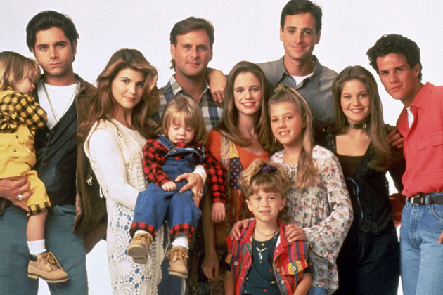
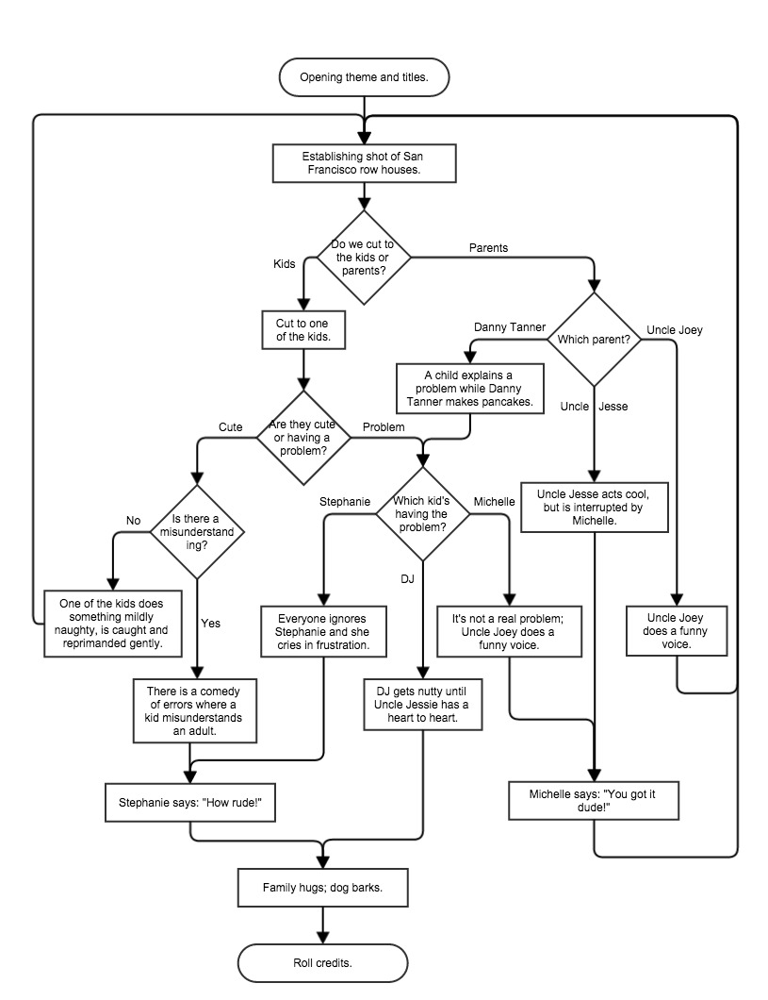
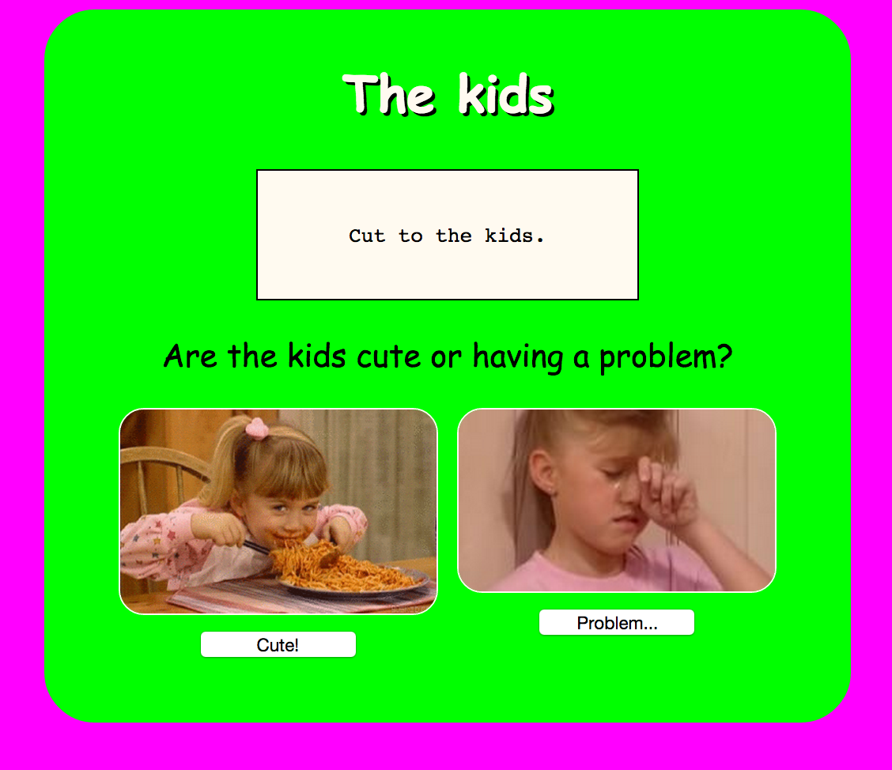

# Full House Script Generator, the Web App!



We're going to make an app that helps you write a script for
[Full House](http://en.wikipedia.org/wiki/Full_House)!

## Setup

Create a new Rails application called `full_house`. There is not any 
deep logic, 
just a series of links to implement, so you do not need to create any 
extra files, 
classes, objects, etc.: just a Rails app!

#### Completion

**This is a bonus assignment!** Only do this if you have completed the `rails_twitter` app.

Parts 6-10 are very difficult and haven't been fully covered in class. 
Therefore, if you don't understand them, it's ok.

#### Flowchart

Here is the flowchart you will use:

<!--  -->


## Planning

Take the time to look through the flowchart/decision tree.  You will notice that some links will take you back to a previously displayed view.

It may help to plan the route definitions in advance, or you can wing it and define the routes and write the views as you go.

## HTML

Each view (`*.html.erb` file) will have:

- An image or images.

- A link that navigates back to the opening page (the `root` route).

- Links representing the options presented to the user.  Note that some pages have three options.

## Images

Add images to every page, to illustrate the current "story board". You can use
any you that you find on the Internet, but a small group of have been provided locally in the `img` folder.

## CSS

Make the site fun. If you have the time, and the stomach, try and theme the style to fit with the wholesome, family-oriented atmosphere of the full house.

Links can be styled to look like buttons!  Take advantage of this fact to make your views more hip looking. Here's how you might include a class when using the `link_to` helper:<br>`<%= link_to "Uncle Joey", joey_path, class: "my-link-button"` 


- [tiled backgrounds](https://developer.mozilla.org/en-US/docs/Web/CSS/background-repeat)
  or [borders](https://developer.mozilla.org/en-US/docs/Web/CSS/border-image)
  made with [geometric](https://www.google.com/search?q=80s+geometric+patterns)
  [patterns](https://www.google.com/search?q=90s+geometric+patterns)

#### A Working App

At this point (completion), you should have a working app. If you'd like a guide
for how to build it, here is an example screenshot:

<!--  -->


## Bonus Bonus Bonus!<br>Data Driven App

Rewrite your app to use a few dynamic route handlers (`/:decision`, eg) and no
more than three ERB templates.

When you do this, hold the data about your site in a data structure (hash) internally.
An example would be a hash, like:

```ruby
$episode_tree = {
  :opening => {
    :text => [
      "Opening titles and theme.",
      "Establishing shot of San Francisco Row Houses."
    ],
    :query => "Do we cut to the kids or parents?",
    :options => [
      {:kids    => :cut_to_kids},
      {:parents => :which_parent}
    ]
  },
  :cut_to_kids => ...
}
```
This hash can be placed in the `ApplicationController` class (`application_controller.rb` file) and will be available in any controller since we are naming it as a global.
