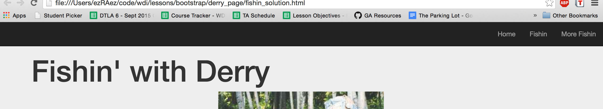
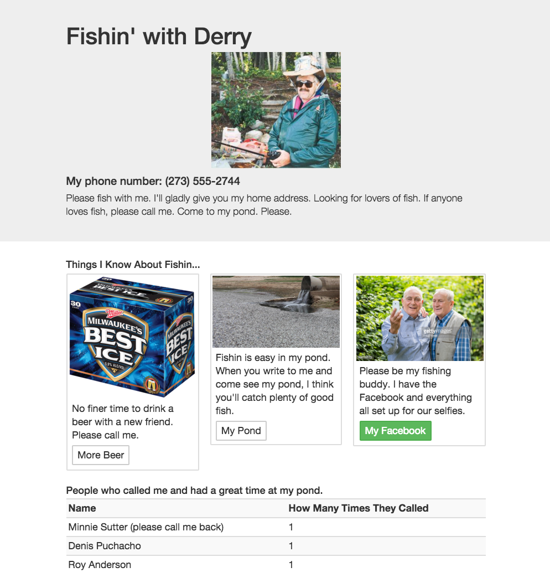

# Uncle Derry's Stupid Fishing Site

## Welcome to Bootstrap

| Lesson Objectives |
| :--- |
| Use an HTML/CSS/JS Framework |
| Describe the grid system |
| Create a responsive website with Bootstrap |


#### Road Map
1. What is Bootstrap?
2. Installing Bootstrap
3. Bootstraps Goodies
4. Fix Uncle Derry's Site - Practice

## Poor Ol' Uncle Derry

Uncle Derry loves him some fishin. You however, do not. In fact, even
Uncle Derry is just plain annoying.

Nevertheless, Uncle Derry heard from Aunt Dawn who heard from Grammy
Penny who heard from Peepaw Wilson that you were a big time web
developer. And now, poor ol' Uncle Derry needs help on his desperate
fishing website's homepage.

You feel bad for your uncle, but your time is short as a billionaire
web-developer. You decide to help, but put in the minimal effort with
a CSS/JS Framework called Bootstrap.

#### What is Bootstrap?

Bootstrap is a CSS/JS Framework. It makes styling a breeze!

Bootstrap easily and efficiently scales your websites and applications
from phones to tablets to desktops with a single code base.

With Bootstrap, you get extensive and beautiful documentation for
common HTML elements, dozens of custom HTML and CSS components, and
awesome jQuery plugins.

Bootstrap ships with vanilla CSS, but its source code utilizes the two
most popular CSS preprocessors, Less and Sass. You can quickly get 
started with precompiled CSS or build on the source.

> Describe a CSS Framework in Tweet length.

## Installing Bootstrap

I've added a markdown for [How to Add Twitter Bootstrap to Your Rails App](https://github.com/ga-students/WDI_DTLA_8/blob/master/resources/cheatsheets/bootstrap_cheatsheet.md)
to Github and included it in `WDI_DTLA_8/resources/cheatsheets` (in
your repos).

But for this lesson, we'll just be using a good ol' CDN.

```html
<link rel="stylesheet" href="https://maxcdn.bootstrapcdn.com/bootstrap/3.3.5/css/bootstrap.min.css">

<script src="https://maxcdn.bootstrapcdn.com/bootstrap/3.3.5/js/bootstrap.min.js"></script>
```

You may need to include jQuery as well depending on which Bootstrap features you use.

```html
<script src="https://code.jquery.com/jquery-2.2.0.min.js"></script>
```

Include these in your head tag.


## Bootstrap Goodies

Bootstrap comes with quite a bit. Too much to cover in one lesson in
fact, but lets look at the most essential features of [Bootstrap](http://getbootstrap.com/).

#### Break into Groups!

1. Navbars
2. Buttons/Tables
3. Grid System
4. Modals
5. Input Groups/Jumbotron
6. Panels/Containers

Each group should take __15 minutes__ to research their topic, and be able
to present it to the class with a small amount of sample code to
demonstrate what they've learned.

__Keep it very small!!__

### __*Your sample code should be about fishing on a separate document.*__

## Fix Up Uncle Derry's Site

Take 20 minutes to use what you've learned in bootstrap to fix up
Uncle Derry's Site. Try and use __NO custom CSS__ when styling his
site! Make sure it looks something like this when you're done:

__navbar__:



<br>

__overall page__:



## Conclusion

Uncle Derry is thrilled at your styling (or as thrilled as Uncle Derry
can be). Let's see what we've learned.

1. What is a CSS Framework?
2. How does Bootstrap help us optimize our websites for different
   screen sizes?
3. Why would a developer bother to use a CSS Framework's grid system?

## References

[Bootstrap Documentation](http://getbootstrap.com/)

Remember to look at other frameworks such as:

- Google's [Materialize](http://materializecss.com/)
- [Skeleton CSS](http://getskeleton.com/) - Ezra's Favorite
- Zurb [Foundation](http://foundation.zurb.com/)
