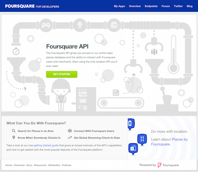
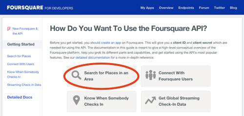

# [▦▨▧▩][4sq]'in it!

## … a Foursquare API weekend lab

> "We'll buy Foursquare for over $100 million."   
> — Yahoo & Facebook, 2010

 

> "[Foursquare's] valuation had been rumored to be as high as $1 billion,
> but our sources say it settled out at $550 million pre-money, 
> $600 million post."   
> — Techcrunch, 2011

 

> "Wait, who is Foursquare?"   
> — Ezra Raez, 2015

### Part 1 – Sign up

Instead of going to the [front page of Foursquare][4sq], like a peasant,
we are going to head in through the [developer entrance][4sq-dev], 
like a Mayor.

[][4sq-dev]

**And now begins the document search!**

Using the API docs, log in (or create an account first, if necessary) 
and get an API key. Here are your hints:

1.  There is no developer login separate from normal user login. Just
    a separate home page.
2.  You need to "create an app" that is authenticated.
3.  By creating an app, they will issue you a "client ID" and a "client
    secret." These, together, are an API key!

When you're done, you'll have this:

<!-- If you give up (and trust me, this isn't obvious or easy), there are 
[explicit directions to follow in the `hints.md` file][hints-1].
Try really hard to do it before going to the hints, tho! -->

### Part 2 – Test the API

Once you have an API Key, you need to make sure you can access the
Foursquare API! Using the information you find in the docs'
[Getting Started guide][4sq-dev-getting-started], piece together
an endpoint and series of params to create a valid request.

Hint:

1.  Use the directions under "Search for Places in an Area." That's
    what we will be doing for the rest of the lab (searching for places).

    
2.  Remember: you can use Chrome, Postman, or `curl` for easy testing of
    API endpoints. You can also crack open a `node` REPL, require
    `request`, and test from there!

<!-- Once again, if necessary, there are 
[detailed directions in `hints.md`][hints-2]. -->

### Part 3 - Initiating an API call from Express

Inside of the `/starter` directory you have an Express app that has been
generated and set up. Get it up and running.

> What steps do we need to take to prepare the app to run?

When it runs, if you navigate to the root route, you should see a form.
When you click on the form, it should render JSON to the screen, like:

**Your job is to make this return the raw JSON from Foursquare: a list
of venues in the given place.**

In order to do this, you will need to:

1.  **Load your API keys in to the application using `dotenv`.**
2.  Add the `request` module to your application.
3.  Add an API call, and handle it, in the `POST /search` route
    handler, found in [`/routes/root.js`](/starter/config/routes.js).

When you're done, it should look more like:

### Part 4 - Add a search term

Now you must update the original form to include another search param,
named `term`, that filters the results. In the form, it should display
with the title "Search For."

When you're done, it should look like:

### Part 6 - Render with EJS and return

Now, instead of returning raw JSON, let's actually display the results!
Use an EJS view, and template the return data into it.

Hints:

1.  Update your routes to be RESTful! If you are listing venues,
    what is the route structure and name?
2.  If you're going to `GET /venues`, then your form needs to change 
    it's `method` and `action` to match!
3.  If you're changing to a Get request, data is submitted into query
    parameters instead of body parameters. These can be found in
    [`req.query`][ex-api-req-query]
4.  Rendering EJS can be different than ERB. [Check out the docs][ejs],
    especially around "unescaped buffering" (printing HTML) and layouts.

When you're done, it should look something like:

---

### Bonus – Integrate the Google Maps API on the client-side

Add a small, embedded map for each location! Use the 
[Google Javascript Map API][gmap-api]. This is especially difficult,
because this API is accessed *from the client*.

Hints:

1.  You'll need to add JavaScript to your application and attach it to
    the pages you're serving.
2.  It'd be easier to start with a single map on the page. For this,
    maybe add a **show** route for each venue that you can link to
    from the index!

<!-- LINKS -->

[hints-1]:   hints.md#part-1--sign-up
[hints-2]:   hints.md#part-2--test-the-api

[4sq]:     https://foursquare.com
[4sq-dev]: https://developer.foursquare.com

[4sq-dev-getting-started]: https://developer.foursquare.com/start

[ex-api-req-query]: http://expressjs.com/api.html#req.query

[ejs]: https://github.com/tj/ejs

[gmap-api]: https://developers.google.com/maps/documentation/javascript/
