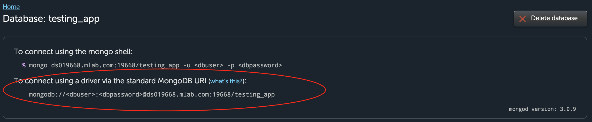

# Applanation!

## Explanation Application Review & Deployment

| Lesson Objectives: SWBAT                 |
| ---------------------------------------- |
| Determine the origin of lines of code: Express or Node |
| Define the difference between `res.json` and `res.render` |
| Deploy an express application to Heroku  |
| Use mLab to host a database              |

##### Road Map:

1. Applanation - Ezra Explains it All!
2. Individual Reading
3. Group Time
4. Class Share
5. Deployment
6. Outro

## Ezra Explains it All!

We'll be taking up the first couple hours of the day reviewing what we learned this week. 

I've provided an outrageously detailed express application to elucidate any obscured understandings of Node and Express.

After we go through it individually, we'll go through it in a small group, then iron out any final questions together as a class.

After we feel comfortable with the app, we'll learn how to deploy it.

## Individual Reading (15 minutes)

Read through the application.

**Take note of what doesn't make sense to you.** Either write it on your table or in a markdown.

## Group Time (15 minutes)

In your groups, discuss what didn't make sense. Try and explain concepts that don't make sense to your classmates. Listen to your fellow classmates on topics that didn't make sense to you.

**Are people confused by the same things!?**

If so, write down those questions! We'll address them in the class share!

## Class Share (40 minutes)

Let's ask the class about the things we don't understand.

We'll take 30 minutes to go around and address at least one question from each group.

## Deployment (40 minutes)

We'll be using Heroku's amazing docs on [Deploying a Node Application](https://devcenter.heroku.com/articles/getting-started-with-nodejs#introduction) for the remainder of the class. 

You'll also need to set up an account on mLab to set up your database. 

After you've signed up, you'll need to:

1. :lightning: Create new DB (select Single-node:Sandbox, aka FREE)
2. Name your DB
3. Create a DB User (give full permissions)
4. Copy the "connect using a driver via …" :point_down:

5. Set the heroku config var for MLAB_URI to that line

You may also want to seed your hosted database. Remember how you did it
with Rails? Heroku's keeps things simple:

`heroku run node config/seeds.js`

You now have a deployed app with seeded data!

## Outro

Now you know all about what comes from Node in an Express app, and what comes from Express! 

You also know how to deploy! Hopefully this will make the weekend that much easier. Let's review a few things.

> - What is path?
> - What's the major difference between res.render() and res.json()?
> - What file do we need to point to for Heroku's Procfile?

##### References

[Deploying a Node Application](https://devcenter.heroku.com/articles/getting-started-with-nodejs#introduction)

[Node.js Docs](https://nodejs.org/en/docs/)

[Express](http://expressjs.com/)

[Express' GitHub](https://github.com/expressjs/express)

[Express: Body Parser GitHub](https://github.com/expressjs/body-parser)
