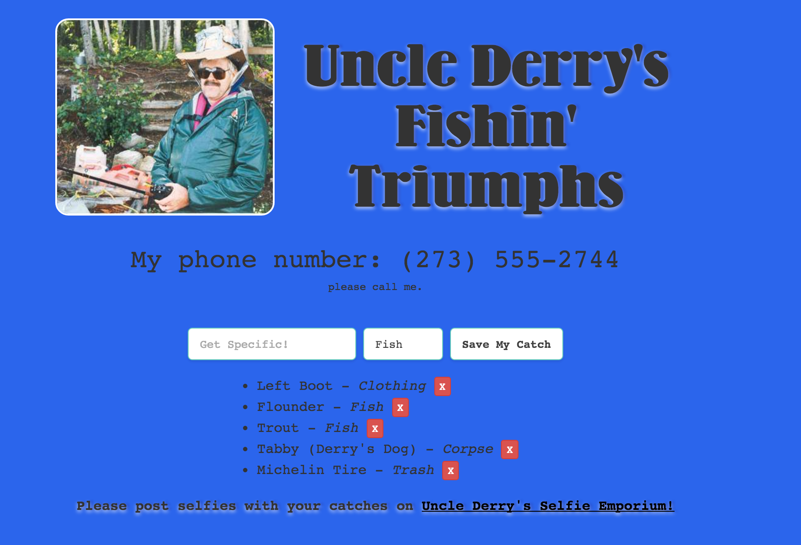

#Fix Derry's Site!

## Practicing AJAX

You're about to write a lot of AJAX-backed JavaScript – using either jQuery or
Vanilla JS, if you're feeling confident – that will complete Uncle Derry's
Fishin' Triumphs Page.

Before working on your client side javascript, ensure both you've run `mongod`
and `nodemon` in your `derrys_fishin_api` directory within your terminal.

Your task is to use your JS & JQuery skills to list out all the
"fish" in our database and get our form working so we can add more catches, edit
existing ones, and delete the less than glamorous.

## Exercise

#### Requirements

- Implement a jQuery AJAX client for a simple REST service
- Build an application that uses AJAX to update a client
- Update an existing API resource from your client with new data
- Delete an existing API resource from your client

#### Starter Code

You'll find the same starter code you had in the last lesson in the
`starter-code` folder. It's a basic index and some styling, along with an
empty `js/main.js`.

#### Deliverable

Make a list of existing catches underneath the form, make the form work, and
then, build your app to add to the list of catches - using the information from
newly created catches - without refreshing the page.

## BONUS/AH

#### Get a handle on JQuery while practicing AJAX

- Update your database from your client (use `PUT` or `PATCH`)
	- You'll need to use a form to insert new data!
- Feel free to use LoDash

### True Bonus
- Take what you've learned from Phil's lesson on client side
  templating, and implement it into your application. 

## Additional Resources

- [Using AJAX Tutorial Video](https://www.youtube.com/watch?v=fEYx8dQr_cQ&index=7&list=PLoYCgNOIyGABdI2V8I_SWo22tFpgh2s6_)
- [http://youmightnotneedjquery.com](http://youmightnotneedjquery.com/)
- [jQuery AJAX Docs](http://api.jquery.com/jquery.ajax/)
- [Some useful jQuery DOM Manipulation Docs](http://api.jquery.com/prepend/)
- [The Official Doughnut API](https://www.doughnuts.ga/)
