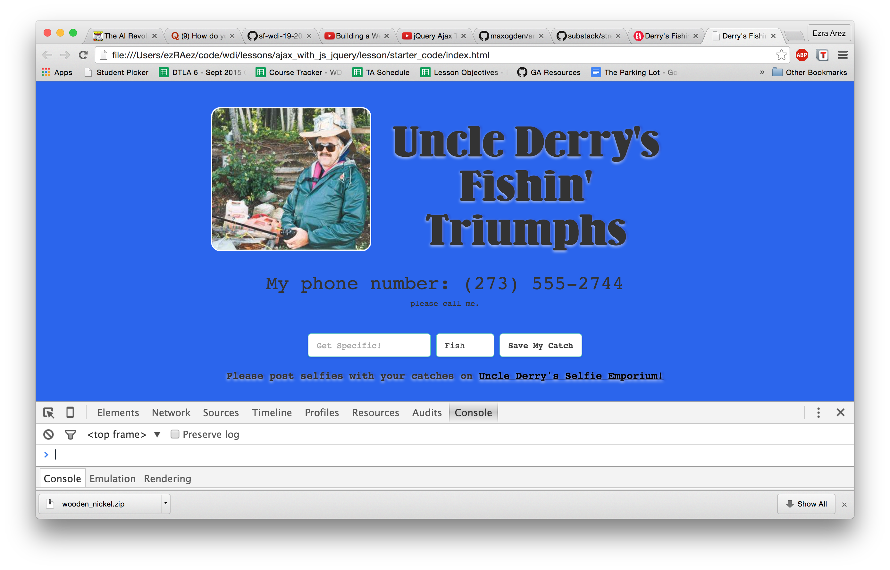
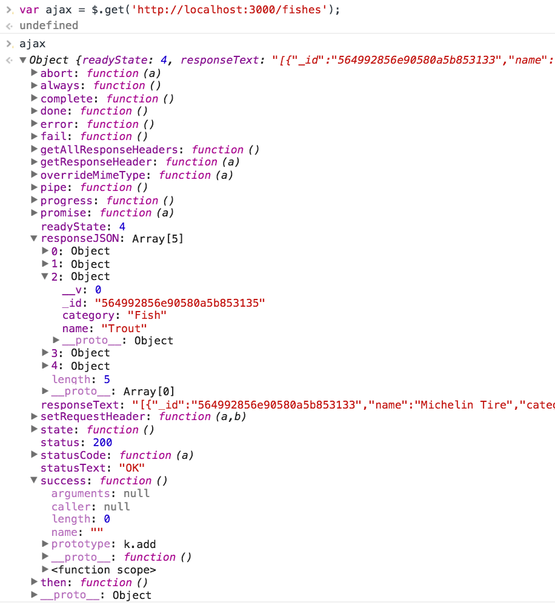

# Uncle Derry's Fishin' Triumphs

##AJAX with JS & JQuery

| Lesson Objectives |
| :--- |
| Implement an AJAX request with Vanilla JS |
| Implement a jQuery AJAX client for a simple REST service |
| Reiterate the benefits of separation of concerns – API vs. Client |

#### Road Map
1. What is AJAX? (20 mins)
2. Setup & Codealong (35 mins)
3. Independent Practice (20 mins)
4. Conclusion (5 mins)

## What is AJAX? Introduction

AJAX (Asynchronous JavaScript and XML) is a method of building interactive
applications for the Web that processes user requests immediately, without
re-rendering a whole page.

> **Example:** A weather forecasting site could display local conditions on one
> side of the page as soon as a user finishes typing in a zip code. The
> temperature could refresh every minute, without the user having to hit a
> refresh button.

In general the process looks like this – use JavaScript on the client side to
hit an API (without reloading a page), then use the pure data you get back to
manipulate the DOM somehow if you need to. This DOM manipulation can take the
form of rendering a template or just changing a number on the page.

###Advantages

- __Faster__ - This is the most obvious reason for using to AJAX on your
  frontend: AJAX allows easier and quicker interaction between user and website
  as pages are not reloaded for content to be displayed.  The server doesn't
  have to get data, render HTML, and then spit it out, it just has to get data
  and your already-loaded frontend does the rest.

- __Compact__ - With AJAX, several application features can be handled using a
  single web page. That means we modularize our app into smaller bits, and it
  becomes easier to work on.

- __Backend Separated from Frontend__ - Applications that use AJAX-heavy
  frontends means developers don't have to work on both sides of the stack at
  the same time. Some developers can be dedicated to building an API that just
  serves data, and others can focus on consuming that data and building
  interfaces.


###Disadvantages

- __The back and refresh button are rendered useless__ - Since things are loaded
  dynamically on a page, without that page reloading (or more importantly a URL
  being changed), clicking the back or refresh button don't work the way you're
  used to. That's actually a pretty big deal – UX designers are very familiar
  with the fact that users are _accustomed_ to being able to hit back when they
  need to. Some advanced front-end frameworks have tried to solve this issue
  with clever workarounds, but that's not always the case and not always
  accurate.

- __Javascript can be disabled__ - While javascript is secure and has been
  heavily used by websites for a long period of time, a percentage of website
  surfers prefer to turn javascript functionality off on their browser,
  rendering the AJAX application totally useless. That's not always the best
  thing to design for, and more often than not, you'll find yourself assuming
  users have JS on, but it's important to know your whole site could be useless
  in some situations.

- __You have to consider the UX even more__ - While UX is crucial for _any_
  application, the fact that a page doesn't refresh means you have to be even
  more considerate of what a user is experiencing. If something in your
  JavaScript goes wrong, your AJAX breaks, and you don't have failsafes
  thoughtfully built in, your user might be clicking a button and seeing
  absolutely nothing happen. Most common users won't have their consoles open to
  notice any errors.

### Why are we learning it?
As you're learning how to build APIs on the server side, you need to start
learning how to consume your APIs on the client side.

While we're going to be tackling some advanced front-end frameworks in the next
unit, you, as a junior full-stack developer, need to be able to do something
awesome with the APIs you're learning to make. So we're going to tackle the
basics and build on them even further, later.

## Setup - Codealong

While we're still learning the ins-and-outs of building APIs, lets use an
already-made API for today. We'll use on that works a lot like Mongo and Express
and comes with RESTful resources out of the box.

Go to [Derry's Github Page](https://github.com/EARnagram/derrys_fishin_api) and
clone the repository __OUTSIDE__ of your class repository.

`git clone <ssh>`

I'm using this API because it will persist our data, allowing us to make 
lasting changes on the API.  Additionally, we'll have practice pulling from our
own API.

Make sure you `npm install`, then run `mongod` and `nodemon` in separate terminal windows.

If you ever save too much data or want to restart, you can always run:
`node config/seeds.js`.

I've also included a basic front end webpage in `starter_code/`. 

Open up your `index.html` in a browser, and you'll see:



Make sure to load up that console - we're going to be working with it quite a
bit.

Now, we've set a few things up for you. Besides the beautiful layout, we've got
here a form with an input  and a select dropdown for you. We've also already
included jQuery, though we won't use that for the first few minutes.

## GET Requests - Codealong

####Vanilla JavaScript

Open up your browser and the console and follow along.   We're gonna start with
old-school JavaScript, so you can see how it works without any libraries.

_**Note:** You might want to write the code out in Sublime first and then copy
it across to your console as it is easier to change typos._

```js
var request = new XMLHttpRequest();

request.open('GET', 'http://localhost:3000/fishes', true);

request.onload = function() {
  if (request.status >= 200 && request.status < 400) {
    // Success!
    var resp = request.responseText;
    console.log(resp);
  } else {
    // We reached our target server, but it returned an error
    console.log('Uh oh, an error on the server side');
  }
};

request.onerror = function() {
  // There was a connection error of some sort
  console.log('Something went wrong with the client side.');
};

request.send();
```

Let's walk through this for a second. AJAX uses HTTP to request XML (or JSON),
so we're going to open a new request and tell it which verb we need and the URL.

According to the documentation, `request.open` takes 3 arguments - `method`,
`url`, and `async`.

Method matches our HTTP verb, URL is obvious, and async is just asking if it
should perform the function asynchronously - by now, you should have a good idea
about what that means.

Then, of course, we've got a function that runs if the requests works, and
another if it doesn't. Simple `console.log` for now.

Finally, we send our request and see what happens. In this instance, we get back
an array of "fishes."

#### jQuery GET Requests

While it's good to have seen the straight old-school Vanilla JS way of doing it,
we've got a lot of libraries these days that are designed to get you there
faster - jQuery is one of those libraries.

Since we've already included jQuery in our HTML's head, let's try doing the same
AJAX GET request with jQuery, together.

If you hit `cmd+k` in your browser console, it'll clear it to start fresh.

```js
var ajax = $.get('http://localhost:3000/fishes');
```

Let's look at what our `ajax` variable holds now.



That's some awesome info. What's this `responseJSON`? Looks useful:

```js
ajax.responseJSON
```

Well isn't that just exactly what we need? How handy!

What did this do? Without refreshing the page, we hit an external API – a
totally different URL that's rendering JSON data instead of views – and brought
that data back into our page.

### A little more programmatically now

While that's great, it's not exactly asynchronous. How do we build this so that
it `console.log`'s the response when an AJAX request actually succeeds, instead
of when we type it in the console?

```js
  var ajax = $.get('http://localhost:3000/fishes')
    .then(function(data){
      console.log(data);
    }, function(err) {
      console.log(err);
    });
```

Type that with me, and hit enter. If there's any luck, our connection will be a
little slow, and you'll see the pause between when we hit enter & when it spits
out our JSON result.

In jQuery's documentation you can find all the chainable callback function
possibilities – the three you'll probably use a lot are `.done`, `.catch`, and
`.then` most of all (as it is shorthand for the other two).

## Independent Practice

Now, using your console, I want to you to try a few more API endpoints:

- Get a single "fish" and spit out the JSON collection in the console
- Use the more generic [$.ajax](http://api.jquery.com/jquery.ajax/) to do the
  same request
- Modify that "fish" by changing it's name
- Add a new catch to the list with name and category
- Remove any nasty finds (such as Tabby, Derry's Dog) from our db using AJAX.


## Conclusion
- What's the main use case of AJAX? Why would anyone use it?
- How do you do a simple GET request in vanilla JS?
- How do you do a GET request with jQuery?
- How do you do a PUT, POST, or DELETE request in jQuery?

#### Extra Reading
- [`No 'Access-Control-Allow-Origin' header is present on the requested resource` – WTF?](https://jvaneyck.wordpress.com/2014/01/07/cross-domain-requests-in-javascript/)
- [What is Cross Origin Resource Sharing (CORS)?](https://www.maxcdn.com/one/visual-glossary/cors/)
- [Using CORS with Express](http://enable-cors.org/server_expressjs.html)
