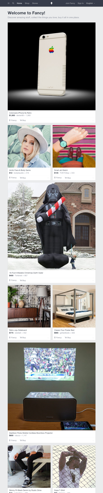

# Fancy App Lab

> "Being fancy is about more than just having a confused   
> identity and a good beat…"
>   
> — *Amethyst Amelia Kelly*

### Setup

Using the given starter code, attempt to recreate the site
[Fancy.com](https://fancy.com). The necessary data can be found in the
file `/js/data.js`, and the assets (including icons) are in `/images`.

### Goal

Use HTML templates to structure the repeating items in the page. 

Feel free, if you are complete with the templating, to add
[Bootstrap](http://getbootstrap.com/javascript) to help you to 
structure the whole page's look and feel.

### Completion

The goal is for the page to look as similar to this as possible.

