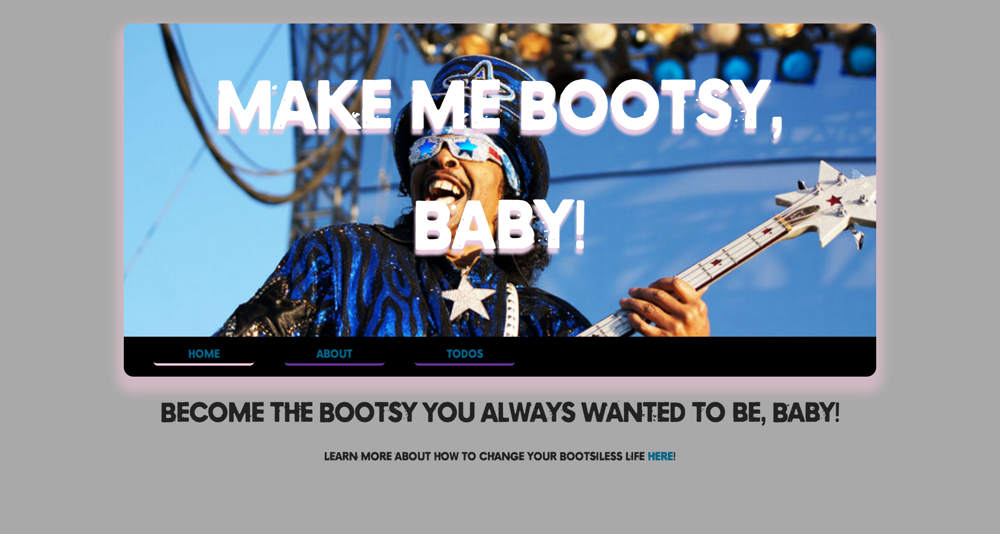
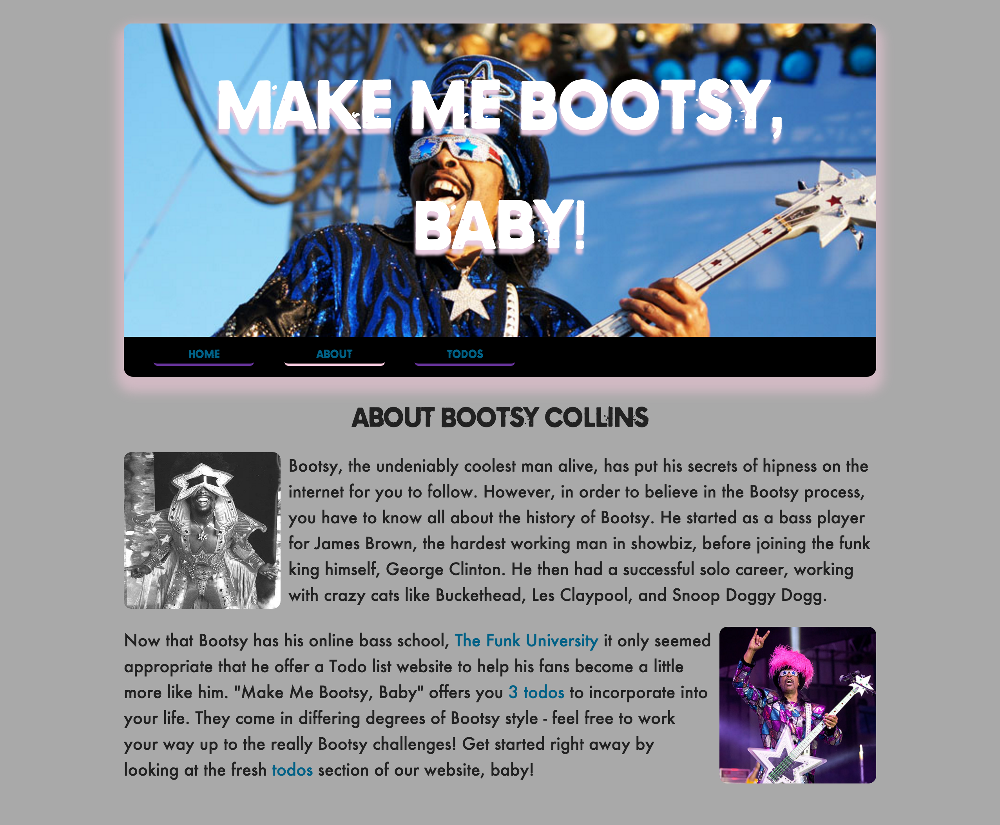
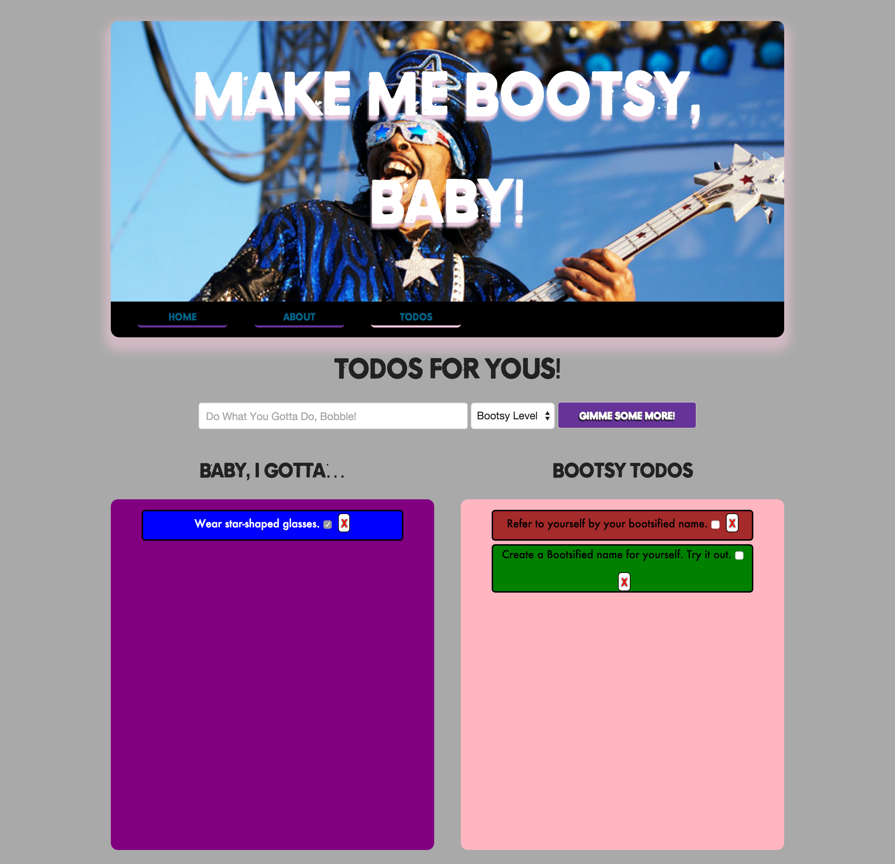

# Make Me Bootsy, Baby

## Todo App Using Underscore Templates

| Lesson Objectives: SWBAT                 |
| ---------------------------------------- |
| Use the underscore library to place dynamic parts of HTML |
| Use templates within EJS                 |
| Build a full MEN stack app               |
| Use AJAX calls within a full stack application |

#### Road Map

1. It's Bootsy, Baby!
2. Pre-planning
3. Server-Side Templates v. Client-Side Templates
4. Things We Gotta Know
5. Let Us Begin!

## It's BOOTSY, Baby!

Today we'll be building a Todo app all about [Bootsy Collins](https://en.wikipedia.org/wiki/Bootsy_Collins), The Man Who Put Bass In Yer Face (back left, here seen in the JBs).

As a lousy bass player, I always wondered, how did Bootsy get so dang good at bass?

As a poor dresser, I always wondered, how did Bootsy get so dang good at dressing himself?

As a poor chiller, I alwasy wondered, how did Bootsy chill so dang hard!?

Quickly, I realized I needed an application that would help me become more like Bootsy Collins. Could you build me a todo app that could help me lead a more Bootsy lifestyle?

## Pre-Planning

Let's quickly look at what the final app will resemble.

**Home Page**: No data is being pulled from the DB.

**About Page**: Needs only the amount of todos in the db.

**Todos Page**: Needs a significant amount of data to CRUD a resource. Additionally, 

## Understanding Lodash templates with AJAX

## Things We GOTTA Know!

Delimiters.

Some stuff about JQuery UI draggables

## Let Us Begin!

We'll be building this app for the remainder of the day. Here's how I expect we'll start:

1. Set up the back-end to ensure we are delivering data.
   - Create a todo model
   - Set up our Todo controller
   - Set up our routes
   - Ensure we can persist and access data using Postman
2. Build our templates
3. Build our scripts to fill said template
   - Set up AJAX calls to gain access to data
   - Attach data to templates
4. Bring it all together and do a bit of styling
   - Use provided css classnames to style page
   - Improve UI by incorporating Drag and Drop with JQuery UI

Today's going to be a busy day, so enjoy your break and then lets get to it.

##### References

[A closer look at Underscore templates](http://www.2ality.com/2012/06/underscore-templates.html)

[Using Underscore.js Templates To Render HTML Partials](http://www.bennadel.com/blog/2411-using-underscore-js-templates-to-render-html-partials.htm)