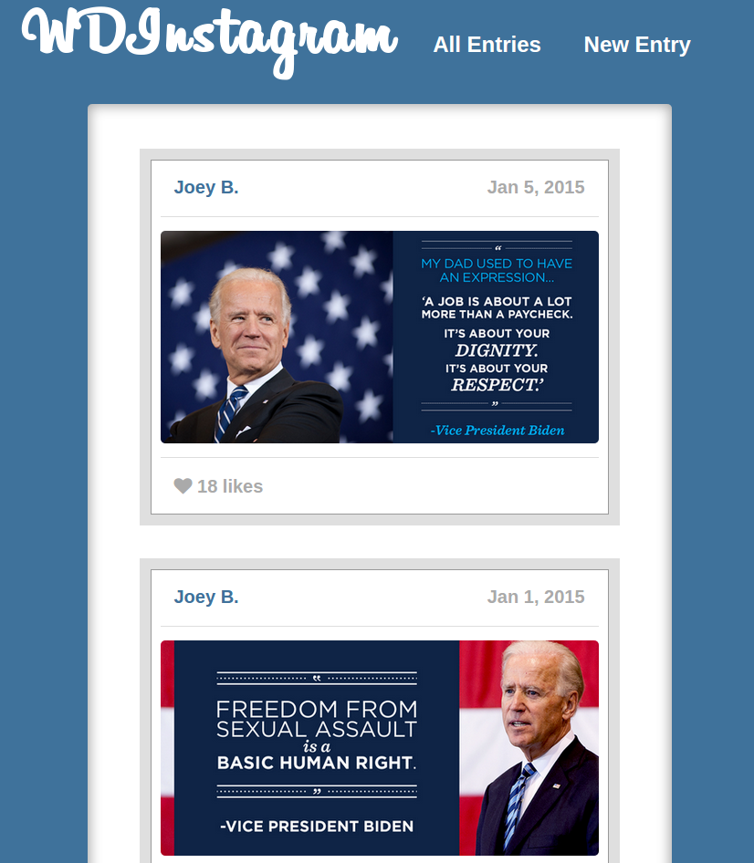
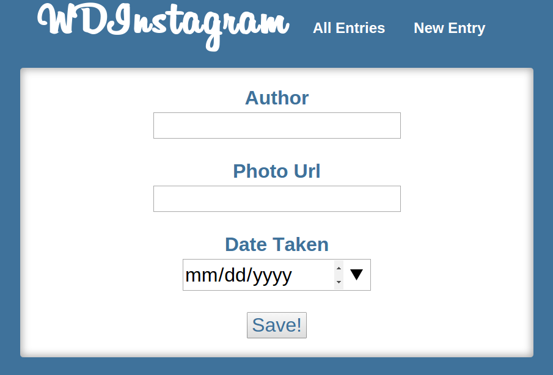
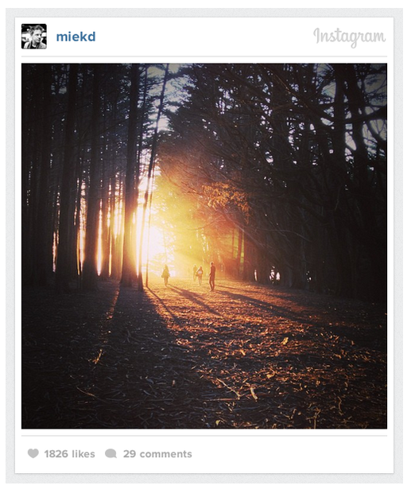

# WDInstagram!

> Here we go, guys, we're making a platform for sharing images!

## Setup

Provided here are assets, already structured in a `/public` folder.

You will have to do everything:

> Create a GitHub repo, and set up your team workflow.
> 
> Register for OAuth with Facebook and set up Facebook authentication as 
> a service. Use Passport authentication in a secure way.
> 
> Create a Mongoose/MongoDB data model, including schema and models, and 
> seed the database.
> 
> Decide upon an API, and create routes and handlers, 
> fill out view templates with EJS and any other necessary HTML, possibly
> use AJAX and Underscore templates to make the site more interactive, and 
> style it!

## Phase 1

**Create a GitHub repo, and set up your team workflow.** Make sure that
there is a single "upstream" repo everyone pulls from, and each member
has their own fork of it.

Everyone's local repo will need their two remotes: `upstream` and 
`origin`. `origin` should refer to their own fork.

## Phase 2

1. **Register for OAuth with Facebook and set up Facebook authentication
    as a service. Use Passport authentication in a secure way.**
2. **Create a Mongoose/MongoDB data model, including schema and models, 
   and seed the database.**

Distribute the work however you deem. Explore all the facets while 
deciding how to do that!

**Remember:** work as pairs whenever possible!

#### Data Model

It is necessary that you create `users` and `entries`, at least.

`users` must have any necessary data to authenticate with Facebook
reliably. At the very least, they need a `name`.

`entries` must have:
   - `author` (user's name who uploaded it)
   - `photo_url` (we aren't uploading photos)
   - `date_taken`
   - `caption` (don't need to implement immediately)
   - `likes` (don't need to implement immediately)
   - `comments` (don't need to implement immediately)
      - `author`
      - `text`

## Phase 3

Following simple user stories, implement the app. Begin with:

#### A user can see an entry.

Create a view and route handler to see a single entry. Pass to it the necessary
data in a hard-coded format. This will largely be about styling and passing
data.

#### A user can see a list of photos from the database.

Set up Mongoose, create a schema, and write the necessary code to read the 
entries from the database. Display the database's contents in the entries list.

#### A user can add (create) a new photo.

Make sure you can POST the form and handle the request. Use `console.log` to
check the params. Write the necessary code, to persist the posted data.

A complete application should have the following routes, at least:

- `GET /entries`: shows a list of all of the entries (use `entries/index.erb`)
- `GET /entries/:id`: shows a single entry (can use `entries/index.erb` or a `entries/show.erb`)
- `GET /entries/new`: shows the form for a new entry (use `entries/new.erb`)
- `POST /entries`: creates a new entry with the POSTed data, and redirects to
  `GET /entries/:id`

## Next Steps - Style

Make the site look however you want! It's already been set up with some CSS that
can help you to mock Instagram's look & feel, if you like.

We structured our index page (list of entries) to look like this:

Finally, we structured our new page (form) to look like this:

We structured our entries after this image, found online:

### Bonus

1. Add the ability to like, or upvote, the entries by clicking on the heart.
1. Add validation: `author` and `photo_url` need to be present, and the 
   `date_taken` should be today by default.
1. Add a `caption` to your entries.
