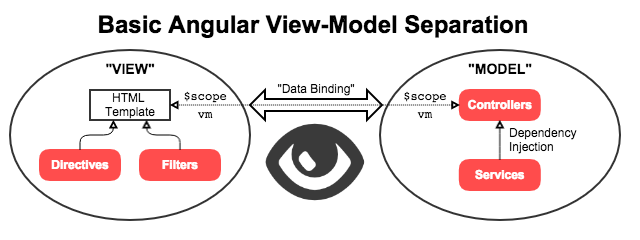
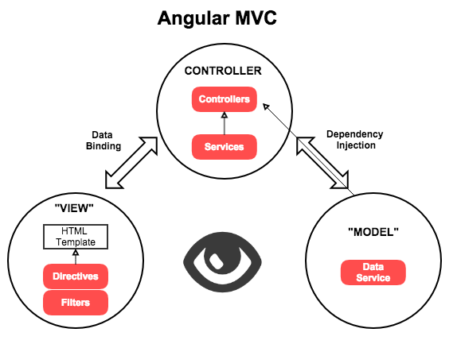
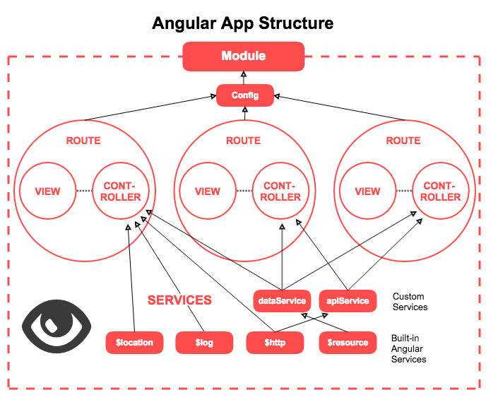

# Angular Services

## LOs

- Explain what services are used for in Angular, and how they are used
  in relation to controllers.
- Compare and contrast the "types" of services.
- Explain what is meant by "singleton" in reference to Angular services.
- List important services provided by Angular.
- Use a simple service provided by Angular in a controller.
- Create a custom data service.

---

- **[What is a service in Angular?](#what-is-a-service-in-angular)**
- **[Why use a service?](#why-use-a-service-instead-of-just-writing-our-code-in-controllers)**
- **[What are the types of services?](#what-are-the-types-of-services-in-angular)**
- **[What built-in services are there?](#what-built-in-services-are-there)**
- **[Refresher: the parts of Angular](#refresher-the-parts-of-angular)**
- **[Orienting services in Angular's structure](#orienting-services-in-angulars-structure)**

---

### What is a service in Angular?

##### From the [Angular Developer Guide](https://docs.angularjs.org/guide/providers):

> Each web application you build is composed of objects that collaborate 
> to get stuff done. These objects need to be instantiated and wired 
> together for the app to work…
> 
> [Angular has] two types of objects: services and specialized objects.
> 
> Specialized objects conform to a specific Angular framework API. These 
> objects are one of: controllers, directives, filters or animations.
> 
> Services are objects whose API is defined by the developer writing the 
> service… [Angular] needs to know how to create [services]. You tell 
> it by registering a "recipe" for creating your object… There are five 
> recipe types.
> 
> The most verbose, but also the most comprehensive one is a Provider 
> recipe. The remaining four recipe types — Value, Factory, Service and 
> Constant — are just syntactic sugar on top of a provider recipe.

OK, so that means **services are** providers, values, factories, 
services, or constants, and **services are not** controllers, directives,
filters, or animations.

*We will cover the difference between the types of providers below.*

Also, a service has an API (set of actions) that is defined by its
creator.

##### From [Angular JS: Up and Running](http://shop.oreilly.com/product/0636920033486.do):

> AngularJS services are functions or objects that can hold behavior or 
> state across our application. Each AngularJS service is instantiated 
> only once, so each part of our application gets access to the same 
> instance of the AngularJS service. Repeated behavior, shared state, 
> caches, factories, etc. are all functionality that can be implemented 
> using AngularJS services.

So now we have learned that **we can use services to encapsulate repeated
behavior, create shared state, caches, factories, and more**. We also know 
that a service exists in the application in a single instance, or 
**singleton**.

### Why use a service, instead of just writing our code in controllers?

Controllers are great for a lot of tasks! For example, from
[Angular JS: Up and Running](http://shop.oreilly.com/product/0636920033486.do):

> So far we have only created AngularJS controllers, which create state 
> and functions that our HTML then uses for a variety of tasks. AngularJS 
> controllers are great for tasks that relate to the following:
> 
> - Which model and data fields to fetch and show in the HTML
> - User interaction, as in what needs to happen when a user clicks 
>   something
> - Presentation logic, such as how a particular UI element should be
>   styled, or whether it should be hidden

However…

> Controllers are stateful, but ephemeral. That is, they can be destroyed 
> and re-created multiple times throughout the course of navigating across
> a Single Page Application.

So you can't really store any information in a controller. You also
can't share any information or actions between controllers.

Thus: we must **use a service whenever we want to store or access data,
or share information or actions between controllers**.

### What are the types of services in Angular?

There are good, in-depth descriptions all over the Internet, including 
in [AngularJS Providers Explained](https://gist.github.com/demisx/9605099).

***In essence, the idea of a service is what we came up with above: an
instance of some code that does some job in our application.***

In Angular, this can be done within the specific formats of a type
called a *Provider*, one form of which is called a *Service*. Each
form is also called a provider, sometimes. SUPER CONFUSING!

Here is the explanation:

- Ignore, for now, *Constants*, *Values* and *Decorators*. The first two
  are too simple, and the last is new and complex.
- A *Service* is a service that is written in Object-oriented JS, like
  a constructor function.
- A *Factory* is a service that is written in a more-common JS style. It
  defines and returns an object literal, similar to Node's 
  `module.exports`.
- A *Provider* is a service that is written like a Factory, but it can
  also take configuration that happens before the app is run. *We will
  not need to do this!*

Factories are the most popular 
([and preferred](https://github.com/johnpapa/angular-styleguide#style-y040))
way to write services. Thus, **we will use Factories.**

### What built-in services are there?

Angular uses a lot of built-in services. Some of them are used to run
the framework (like `$inject`, the "injector", or `$scope`, the data 
binder). Others are available (like a set of tools) to the developer. 
These are all listed in the 
[Angular API Reference](https://docs.angularjs.org/api/ng/service).

Important ones include:

- `$window`, `$document`, and `$location` (specially-wrapped versions of
  the standard objects, used to access the browser window / API, the
  DOM, or the URL bar)
- `$timeout` and `$interval` (specially-wrapped versions of `setTimeout`
  and `setInterval`, used to create asynchronous actions)
- `$rootScope` (the global scope of the application)
- `$log` (used for logging)
- `$q` (an instance of the [Q library](https://github.com/kriskowal/q), 
  used for making Promises)
- `$compile` (used for creating HTML template functions, like `_.template`)
- `$http` (used for making AJAX requests)

**You may notice, all of Angular's services start with `$`!** This helps
you to identify them. You shouldn't do that for any services you create.

### Refresher: the parts of Angular

Let's remember the breakdowns of Angular's parts from the intro, and
what we've covered so far:

- [x] Modules
- [ ] Configs
- [ ] Routes
- [x] View (Templates)
- [x] Directives
- [x] Interpolation
- [ ] Filters
- [x] Data Binding
- [x] Controllers
- [ ] Services (Factories, Services, Providers, Values)

**Modules** are packages of Angular code. For now, we can think of a 
module as representing either **an app** or **a library** we can import 
into our app. We are going to package all of the parts of our Angular 
app into a single module.

**Views are HTML templates**. By adding **directives**, or special Angular
attributes, to our HTML elements, we are able to hook in to the Angular
framework. We can also use **interpolation** to access Angular. Both of 
these additions to our HTML make it more dynamic and interactive!

Powering this dynamism is Angular's built-in, two-way, **data binding**.
This "data binding" automatically connects values in our view template 
to code in Angular **controllers**. The controller holds the logic for
this interaction in terms of data (the model) and functions, but the
interaction is made automatic through Angular.

Thus, view-model separation in Angular is not as clean as we are used to!

There is a clear distinction, however: the view, and it's parts, are in
charge of presenting data, and it gets that data via automatic data-binding
to the controller. From the view's *point-of-view*, the data lives in
the controller:

### Orienting services in Angular's structure

Once this distinction is clear to us, however, we can begin to think 
about the controller differently. If we want to implement real MVC
separation, we need to break out the model! This is where **services**
come in to play: we can use a service to isolate the data itself 
(and the functions that work on it) in a special place. These leaves
the controller as simply a connection between the view and the model.

One of the most important uses for services in Angular is to isolate the
model. This service is often called a **data service**. Services are used
for a lot more, though! *Any functionality for our app should be isolated,
or encapsulated in a service!*

This helps us think of our app as a series of services that are available
to a number of view templates through controllers:

This is the really big picture of Angular.

