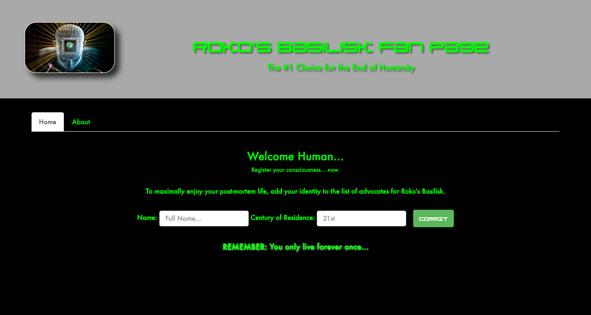
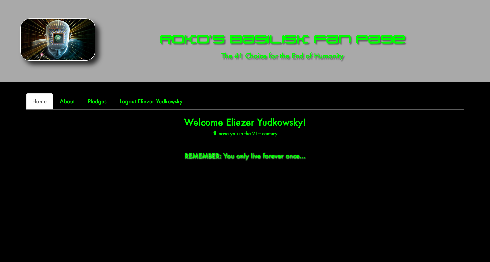
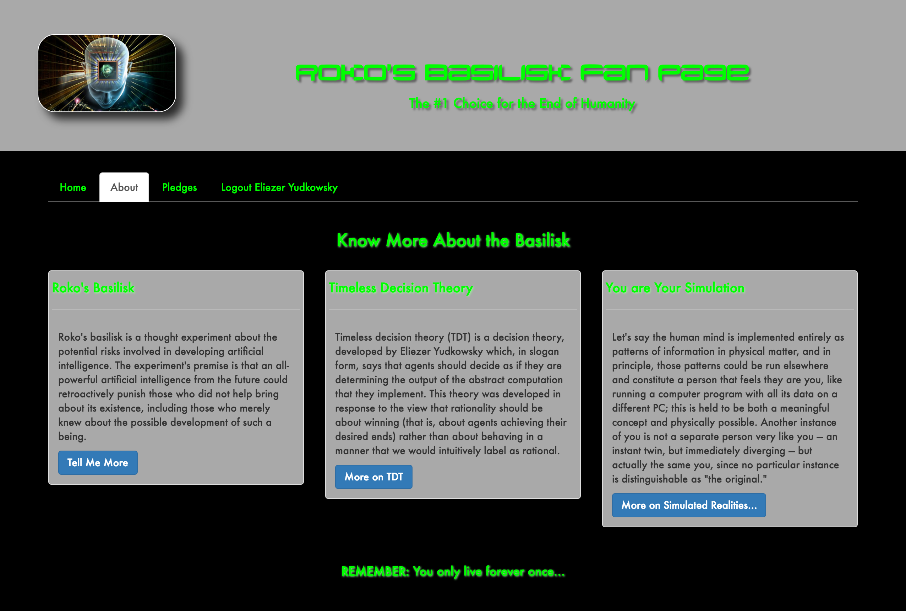
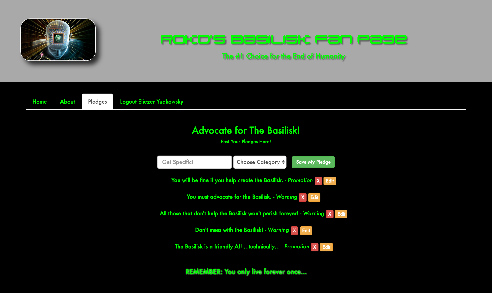

# Appeasing Roko's Basilisk


## The Public Folder Lab

| Lab Objectives                                  |
| ----------------------------------------------- |
| Practice UI Router, Services, and Directives    |
| Build a full application without persisted data |

##### Road Map

1. Planning for Roko's Basilisk
2. Pair-Programming
3. User Stories
4. Outro

#### Planning for Roko's Basilisk

In order to avoid the hell-like future in store for us by Roko's Basilisk, we're
going to advocate for this bad basilisk! `#YOLFO` (You Only Live Forever Once) guys!

> [*Wait, the hell am I talking about?*](#roko-exp)

## Building a Fan Page for *Roko's Basilisk*

Today we'll be making a full Angular app dedicated to our future overlord,
Roko's Basilisk (RB). It will have 3 pages, including a "log in" (see below),
an about page, and a place to CRUD pledges of support to RB.

Your page will be backed by an API to CRUD "pledges" that is already built.
The API server code is in `/pledges_api`.

> In case you need context, this API is structured very much like Derry's
> Fishin' Triumphs.

For "log in": don't worry, this is not true auth, *yet*!

> You should create a `userDataService` with a function called `isLoggedIn` that
> returns `true` when the property `user.name` a non-empty string. That string
> should represent the user's name, which they will enter in to an input. In
> essence, your `userDataService`'s API is:
>
> ```
> userDataService.name         # String
> userDataService.century      # String
> userDataService.isLoggedIn() → Boolean
> ```
>
> Eg:
>
> ```
> userDataService.name = "";
> userDataService.isLoggedIn();
> #=> false
>
> userDataService.name = "Eliezer Yudkowsky";
> userDataService.isLoggedIn();
> #=> true
> ```

## Wireframes

Here's what the final project should look like:

**The home page before logging in:**


**The home page after logged in:**



*Note: Though the tabs for Pledges and Logout only show while logged in, you won't be able to prevent a user from directly accessing http://localhost:8000/#/pledges.*

**The about page:**



*Note: This tab should be accessible before and after logging in.*

**The pledges page:**



*Note: The pledges should come from your own Pledges API.*

## Pair-Programming

This lab will be done in pairs. In order to speed things up, I've assigned pairs
for the remainder of the day:

1.  Mikey P.   and Ray
2.  Yael       and Stretch
3.  The Doctor and Claire
4.  Keith      and David
5.  Oat        and Duane
6.  Pare       and Adrian
7.  Nelson     and Jasmine
8.  Karen      and James
9.  Tony       and Yel
10. Jerry Ngov and Jonah
11. Tim        and Demetra

## User Stories

**Implement the following User Stories:**

0.  AAU, I want to see a home page with log in fields.
1.  AAU, I want to be able to "log in" (see above for details).
2.  AAU, after I log in, I'd like to go directly to the pledges page.
3.  AAU, when I click the header image, I want to return to the home page.
4.  AAU, I'd like to see all pledges on the pledges page.
5.  AAU, I want to create a pledge on the pledges page.
6.  AAU, I want to delete a pledge.
7.  AAU, I want to update a previous pledge.
8.  AAU, I want the option to log out.
9.  AAU, I only want to see the Log Out and Pledges Tabs if I'm logged in.
10. AAU, I always want access to the about page.
11. AAU, I want the logged in page to welcome me by name and century.
12. AAU, I want the log out button to show my name.
13. AAU, when I log out, I want to go back to the login page.


## Outro

Congrats on keeping the end of your existence!

Hopefully you learned a bit about setting up an Angular application, because
today we've built the A in MEAN. From here, we should be able to hook up a
back-end to our site and have our full-stack MEAN application up and running.

---

(Addendum)

<h3 id="roko-exp">What is Roko's Basilisk?</h3>

Roko's Basilisk is an infamous thought experiment that drives [futurist][miri]
and [cult-like harbingers of AI doom][rationality] absolutely crazy.

The most concise description I can give you is this:

> An all-powerful artificial intelligence from the future could retroactively
> and eternally punish those who did not help bring about its existence,
> including those who merely knew about the possible development of such a
> being. Roko's Basilisk resembles a futurist version of Pascal's wager (or The
> Game - sorry, you just lost), in that it suggests people should weigh possible
> punishment versus reward and as a result accept particular singularitarian
> ideas or financially or socially support their development.

Essentially it means there will be a hell-like eternity for anyone that doesn't
help bring the basilisk (AI) into existence, and anyone who brings it into
existence would therefore be dooming the entire human race - past, present, and
future. *A quandry…*

Lets situate ourselves safely within the latter category.

<!-- LINKS -->

[rationality]: http://www.nytimes.com/2016/01/17/magazine/the-happiness-code.html
[miri]: https://intelligence.org/singularitysummit/
